# Apeiron: Technical Overview

*Apeiron* (ἄπειρον, "the infinite") is a proof of concept for an **Infinity Blotter**: a browser grid showing **1M+ FX
algo orders × 50 columns**, ticking live, with server-side filter, sort, group and aggregation, order actions, and
**50 concurrent clients** on one Node process.

This document is for engineers who will maintain or extend the POC. It explains what was built, how it works, why it was
designed this way, and what it achieved. Every number carries its source: a checkpoint report under
[`docs/checkpoints/`](checkpoints), [`TESTING.md`](TESTING.md), or the fresh runs recorded for this document
(§9.4, "Fresh run, 2026-10-09").

**Status (2026-10-09).** Phases 1 to 9 are merged to `main`. Phase 9 (resilience suite, PR #10) was merged on 2026-10-08,
so the resilience results in §11 are **final** (CP-6 and its fixes). AWS was never deployed (paused by the user, §13).

Companion documents: [`USER-GUIDE.md`](USER-GUIDE.md) (how to run and use it), [`TESTING.md`](TESTING.md) (every test
layer), [`architecture.md`](architecture.md) (a shorter architecture tour), [`hosting.md`](hosting.md),
[`db-adapters.md`](db-adapters.md), [`DEMO-SCRIPT.md`](DEMO-SCRIPT.md), and [`PLAN.md`](PLAN.md) (the authoritative
contracts in its appendices).

## Contents

1. [Problem and goals](#1-problem-and-goals)
2. [Architecture](#2-architecture)
3. [Data model](#3-data-model)
4. [Server internals](#4-server-internals-antikythera)
5. [Protocol](#5-protocol)
6. [Client internals](#6-client-internals-pharos)
7. [Simulation and data](#7-simulation-and-data)
8. [Observability](#8-observability)
9. [Performance results](#9-performance-results)
10. [The death spiral (CP-4)](#10-the-death-spiral-cp-4)
11. [Testing strategy](#11-testing-strategy)
12. [Decisions and trade-offs](#12-decisions-and-trade-offs)
13. [Limitations and next steps](#13-limitations-and-next-steps)

---

## 1. Problem and goals

A trader's blotter must show every order, not a page of them, and keep it current:

| Requirement | Scale |
|---|---|
| Rows | 1,000,000+ FX algo orders (6 months of history plus the current book) |
| Columns | 50, every one sortable and filterable; 14 groupable |
| Live prices | 20 currency pairs × 3 ticks/s; every LIVE order is repriced on its pair's tick |
| Order flow | ~100 updates/s and ~5 new orders/s (Medium); ~2,000 updates/s and ~50 new orders/s (Stress) |
| New rows | Arrive on top under the default sort; a scrolled-down view must not move; an "N new orders ↑" badge counts them |
| Interaction | Filter (text, number, date, set), multi-column sort, row grouping with aggregates, per trader scope |
| Actions | Right-click Cancel / Pause / Resume on LIVE and PAUSED orders |
| Clients | 50 concurrent blotters, each with its own view, on one server |

**POC targets** ([`PLAN.md`](PLAN.md), "Load-test harness"; tick-to-screen ruled end to end in
[`CP-4-review.md`](checkpoints/CP-4-review.md)):

| Target | Limit |
|---|---|
| `getRows` p95 (warm block fetch, client-measured) | < 50 ms |
| Sort / filter / group change on 1M rows (cold view build) | < 300 ms |
| Tick-to-screen p95, **end to end** (source event in hermes → client receives the delta), 50 clients, whole run incl. stress | < 150 ms |
| Server event-loop lag p99 | < 50 ms |
| Server RSS with 50 clients | < 2 GB |
| Scrolling | 60 fps |
| Order action (click → status on screen) | < 500 ms (phase 6 done criterion) |

All of them were met in the CP-4 reference runs on a laptop (§9.1). A fresh reproduction on a 4–7× slower cloud host
met the RSS target only (§9.4): headroom on the reference hardware is large, but capacity is bound by one CPU thread.

## 2. Architecture

### 2.1 Components and codenames

| Codename | Path | Role |
|---|---|---|
| **pharos** | [`apps/pharos`](../apps/pharos) | Web app: React 19, Vite 8, AG Grid Enterprise 36 server-side row model (SSRM), Web Worker transport, Zustand; served by unprivileged nginx |
| **antikythera** | [`apps/antikythera`](../apps/antikythera) | Blotter server: Fastify 5 + `ws`; SharedArrayBuffer columnar store, query engine, incremental views, budgeted flush loop, per-client tracking and deltas, metrics |
| **hermes** | [`apps/hermes`](../apps/hermes) | Mock middleware: price feed and order lifecycle on NATS JetStream; executes commands; Medium/Stress presets |
| **gaia** | [`apps/gaia`](../apps/gaia) | One-shot seeder: 1M deterministic orders into Mongo |
| **talos** | [`apps/talos`](../apps/talos) | Load-test harness: N open-loop WebSocket clients |
| **logos** | [`packages/logos`](../packages/logos) | Shared vocabulary: `Order`, the 50 `ColumnMeta`s, protocol, codecs, filter model, PRNG and generator, lifecycle maths, `Bus` port |
| **mnemosyne** | [`packages/mnemosyne`](../packages/mnemosyne) | `OrderRepository` port, Mongo and in-memory adapters, contract suite |
| **iris** | [`packages/iris`](../packages/iris) | NATS/JetStream adapter for the `Bus` port (stream and consumer definitions) |
| **e2e** | [`e2e/`](../e2e) | Playwright E2E and the resilience suite |

Two ports keep infrastructure replaceable: `OrderRepository` (storage) and `Bus` (messaging). The engine, protocol and
UI depend on neither Mongo nor NATS.

### 2.2 Component diagram

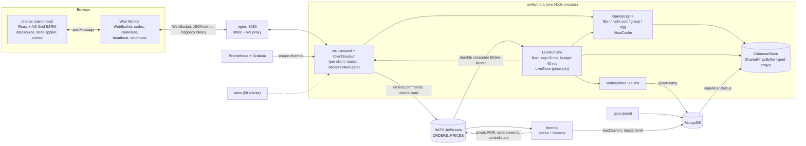

### 2.3 Deployment (Docker Compose)

Every service runs in a container; the laptop and the (paused) AWS box use the same compose file
([`infra/docker-compose.yml`](../infra/docker-compose.yml), included from the root [`compose.yaml`](../compose.yaml)).
All published ports bind to `127.0.0.1`.

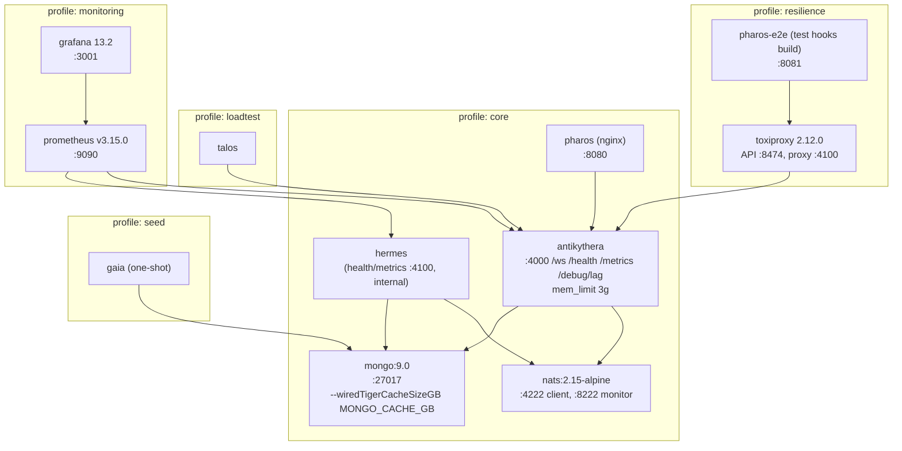

Volumes: `mongo-data`, `nats-data`, `prometheus-data`. See [`hosting.md`](hosting.md) for env vars and the AWS design.

## 3. Data model

### 3.1 The 50 columns

One metadata file, [`packages/logos/src/columns.ts`](../packages/logos/src/columns.ts), drives both the server engine and
the client's column definitions ([`apps/pharos/src/grid/column-defs.ts`](../apps/pharos/src/grid/column-defs.ts)).

```ts
type ColumnMeta = {
  field: OrderField; header: string;
  type: 'string' | 'enum' | 'number' | 'datetime' | 'date';
  filter: 'text' | 'set' | 'number' | 'date';
  groupable: boolean;
  aggFunc?: 'sum' | 'avg' | 'wavg:notionalUsd' | 'count';
  decimals?: number;        // fixed decimals for non-price numbers
  pairDecimals?: boolean;   // price columns: decimals follow the row's pair
  nullable?: boolean;
  width?: number;
  priceColumn?: boolean;    // drives the up/down flash
};
```

| Group | Columns |
|---|---|
| Identity (6) | orderId, parentOrderId, clientOrderId, traderId, traderName, account |
| Instrument (5) | currencyPair, baseCcy, quoteCcy, tenor, valueDate |
| Order (8) | side, algoType, status, orderType, timeInForce, urgency, venue, strategyParams |
| Quantity (6) | orderQty, filledQty, remainingQty, pctComplete, notionalUsd, filledNotionalUsd |
| Price (9) | limitPrice, arrivalPrice, avgFillPrice, marketBid, marketAsk, marketMid, lastFillPrice, distanceToLimitBps, spreadBps |
| Performance (6) | slippageBps, slippageUsd, unrealisedPnlUsd, realisedPnlUsd, vwapBenchmark, perfVsVwapBps |
| Execution (4) | numFills, numChildOrders, participationRate, lastFillQty |
| Time (6) | createdAt, startTime, endTime, lastUpdateTime, completedAt, durationMins |

- **Groupable (14):** traderName, account, currencyPair, baseCcy, quoteCcy, tenor, side, algoType, status, orderType,
  timeInForce, urgency, venue, valueDate.
- **Default aggregates:** `sum` for orderQty, filledQty, notionalUsd, filledNotionalUsd, slippageUsd, unrealisedPnlUsd,
  realisedPnlUsd, numFills; notional-weighted average (`wavg`) for slippageBps, perfVsVwapBps, pctComplete; `count` is
  always the group's row count (= `childCount`).
- **Statuses:** `PENDING_START`, `LIVE`, `PAUSED`, `FILLED`, `CANCELLED`.

### 3.2 Null semantics (CP-1, the same everywhere)

- **Storage:** a null number or date is `NaN` in its `Float64Array`; it becomes `null` at the boundary (wire, DB).
- **Sort:** null is the *smallest* value: first ascending, last descending (AG Grid's own client-side behaviour).
- **Filter:** only `blank` / `notBlank` match null; every other number/date operator never matches it.
- **Aggregates:** nulls are skipped (with their weight in `wavg`); all-null gives null, except `count`.
- Nullable columns: limitPrice, avgFillPrice, lastFillPrice, distanceToLimitBps, slippageBps, vwapBenchmark,
  perfVsVwapBps, completedAt.

### 3.3 Pair decimals

Price columns have no fixed `decimals`; they format with the row's pair (`PAIR_BY_NAME`): JPY pairs 3, SEK/NOK/MXN/ZAR/CNH/TRY
4, all others 5 (PLAN Appendix B, CP-1).

### 3.4 Other contracts that matter

- **Default ordering:** an empty `sortModel` means `createdAt desc`; every sort ends with an `orderId` tiebreaker in the
  direction of the last key, so blocks never overlap or skip rows.
- **Dates:** every date filter operator is UTC-day granular; `inRange` is inclusive for numbers and dates (CP-2).
- **Group keys:** strings on the wire; `valueDate` as `YYYY-MM-DD` (UTC); null as `"(blank)"`.
- **Row ids:** leaf `orderId`; group `"G:" + [...parentKeys, key].join("|")`.

### 3.5 The seeded dataset

[`gaia`](../apps/gaia) generates orders with a seeded PRNG (`mulberry32(SEED=42)`): the same seed gives the same dataset
([`packages/logos/src/generator.ts`](../packages/logos/src/generator.ts), PLAN Appendix E).

- 1,000,000 orders over the last 182 days (weekdays, weighted to 07:00–17:00 London), 5 fictional traders (35/25/20/12/8%),
  3 accounts each, 20 pairs (EURUSD 25%, USDJPY 15%, GBPUSD 12% …).
- Quantity log-normal 1M–100M; algos TWAP 30, VWAP 25, POV 15, ICEBERG 12, IS 10, SNIPER 8; historical status FILLED 92%
  / CANCELLED 8%; prices consistent with a per-pair random walk.
- About 400 LIVE and 200 PENDING_START current orders with the highest ids (`'ALG' + zero-padded sequence`).
- Inserted in batches of 10,000; a second run is a no-op; `SEED_RESET=true` re-seeds a fresh window anchored to today.

## 4. Server internals (antikythera)

### 4.1 SharedArrayBuffer columnar store

[`apps/antikythera/src/store/columnar-store.ts`](../apps/antikythera/src/store/columnar-store.ts),
[`dictionary.ts`](../apps/antikythera/src/store/dictionary.ts), [`string-rank.ts`](../apps/antikythera/src/store/string-rank.ts).

Orders are never held as objects. Each column is a typed array on a `SharedArrayBuffer` (so a `worker_threads` pool could
read it later without copying, Appendix F):

| Column kind | Storage | Per row |
|---|---|---|
| number, datetime, date (32 columns) | `Float64Array`; null = `NaN`; `-0` stored as `0` | 8 bytes |
| enum (14 columns) | dictionary codes in `Uint8Array` (widens to `Uint16Array` past 256 values) + a per-dictionary rank array | 1 byte |
| free-text strings (orderId, parentOrderId, clientOrderId, strategyParams) | one `string[]` each, plus a lazily built **sort-rank** array per column | heap |
| lookup | `orderId → rowIndex` `Map` | |

Measured at 1M rows ([`CP-2.md`](checkpoints/CP-2.md), "Store memory layout"): typed arrays **257.5 MB used**
(386 MB reserved for 1.5M rows of headroom), string heap ~165 MB, heap after GC **223–226 MB**. Capacity is reserved up
front (`STORE_CAPACITY`, 1.5M; grows 1.5×), so arrays don't reallocate while serving. Row objects are materialised only
for blocks being sent (`rowAt`).

**Loading** ([`loader.ts`](../apps/antikythera/src/loader.ts)) streams `repo.loadAll()` in batches of
`LOAD_BATCH_SIZE=200` (CP-2 F4b: dropping from 10,000 cut peak RSS from 1,808 MB to 876 MB and load time from 15.8 s to
9.5 s), yields between batches, builds string ranks, and reports load time and RSS. The server listens first, so
`/health` answers (503) during the load.

### 4.2 Query engine

[`apps/antikythera/src/query/`](../apps/antikythera/src/query): pure functions over the store, property-tested against a
naive reference ([`testing/reference.ts`](../apps/antikythera/src/testing/reference.ts)) and checked by the CP-2 reviewer
against MongoDB as an independent oracle (identical results, aggregates within 1e-14).

- **Request normalisation** ([`request.ts`](../apps/antikythera/src/query/request.ts)): validates the SSRM request,
  rejects pivot, and reduces it to a canonical form plus a **view key** (trader, filter, sort, group columns; key order,
  set-value order and condition order don't matter; flat views ignore `valueCols`).
- **Filter compilation** ([`filter.ts`](../apps/antikythera/src/query/filter.ts)): the AG filter model plus the trader
  scope compile into predicates over the column arrays. Cheap predicates first; set filters become an
  allowed-dictionary-code lookup table (no string compares); dates compare epoch ms against UTC-day bounds.
- **Sort** ([`sort.ts`](../apps/antikythera/src/query/sort.ts)): an **LSD radix sort over 16-bit digits** producing a
  `Uint32Array` of row indexes.
  - Numbers: the Float64 bit pattern is turned into an order-preserving unsigned key (negative values: invert all bits;
    positive: flip the sign bit; NaN → 0, so null sorts smallest; `-0` = `0`); descending inverts the key. Four 16-bit
    passes per numeric key.
  - Enums: one pass over the dictionary **rank** (so sort order is alphabetical, not insertion order).
  - Strings: two passes over the cached per-row **string rank**.
  - The `orderId` tiebreak is free: while `store.idsAscending` holds, row order *is* id order, so the radix sort's stable
    starting order encodes it. If ids ever stop ascending, a comparator sort over the same total order takes over.
  - Rows appended since the string ranks were last built are comparator-sorted and merged in (up to 50,000), so a live
    append never forces a rank rebuild on the hot path; a background task refreshes ranks in slices at most every 30 s.
- **Group and aggregate** ([`group.ts`](../apps/antikythera/src/query/group.ts)): one-pass bucketing by enum code or UTC
  day, running `sum`, non-null `count` and weight sums per value column; `wavg` = Σ(w·x)/Σw weighted by `notionalUsd`.
  Group rows sort by key unless the sort names an aggregate.

**Cold build timings at 1M rows** ([`CP-2.md`](checkpoints/CP-2.md), `vitest bench`, Apple silicon, means):

| Operation | Mean | Target |
|---|---|---|
| Default view (createdAt desc) | 24.5 ms | < 300 ms |
| Selective filter + sort (46,571 rows match) | 11.7 ms | < 300 ms |
| Three-column sort over all rows | 29.6 ms | < 300 ms |
| One-level group, four aggregates | 11.1 ms | < 300 ms |
| Two-level group (expand EURUSD) | 13.9 ms | |
| Warm block fetch, 100 rows | 0.109 ms (p99 0.27 ms) | < 5 ms |

### 4.3 The view cache

[`view.ts`](../apps/antikythera/src/query/view.ts), [`view-cache.ts`](../apps/antikythera/src/query/view-cache.ts).

A **view** is the result of one query: the filtered root rows, plus — built lazily per route as clients ask for them —
the sorted leaf index and group levels (buckets with members and running aggregates). Views are keyed by the view key, so
**clients with the same view share one result**. The cache is LRU, capped by count and bytes (`VIEW_CACHE_MAX_VIEWS` 64,
`VIEW_CACHE_MAX_MB` 384), and views idle for 60 s with no subscribers are swept. A flat 1M-row view costs about 8 MB
(CP-2).

### 4.4 Incremental view maintenance

Before phase 5, any store change dropped every view. Live data made that impossible, so views patch themselves from a
per-tick **ChangeSet** ([`query/changeset.ts`](../apps/antikythera/src/query/changeset.ts); PLAN Appendix D).

- `LiveStore.flush()` ([`live/live-store.ts`](../apps/antikythera/src/live/live-store.ts)) applies queued order events
  and price ticks to the store in place (`updateRow` returns changed fields and previous values) and records each changed
  row: `{row, isNew, fields, prev, lo/hi field mask, ts}`. `prev` keeps the *first* old value per field in the tick, and
  `ts` the earliest source-event timestamp (used for `delta.srcTs`).
- **Price join:** `liveByPair` maps each pair to its LIVE/PAUSED rows; a tick reprices only those rows (market bid/ask/mid,
  spread, distance-to-limit, slippage, unrealised P&L), and `lastUpdateTime` never moves backwards (resilience bug 3).
- `View.applyChanges` classifies each changed row with a 64-bit field-mask intersection:
  - **value-only**: no changed field is in the view's sort, filter or group columns → nothing moves; clients holding the
    row get the new values.
  - **structural**: a changed field is in those columns, or the row is new → one O(n) compaction pass removes the rows,
    membership is re-tested, survivors are sorted among themselves and merged back in O(n); group buckets are created or
    removed; affected aggregates adjust by `new − prev` (weighted averages keep Σ(w·x) and Σw).
  - more than `STRUCTURAL_REBUILD_THRESHOLD` (5,000) structural rows → the view needs a rebuild (deferred, §4.5).
- Property tests ([`view.incremental.property.spec.ts`](../apps/antikythera/src/query)) assert that a patched view
  equals a fresh build after every tick, including the carried-over, deferred and untracked paths.

### 4.5 The budgeted flush loop

[`live/runtime.ts`](../apps/antikythera/src/live/runtime.ts) (`LiveRuntime.flush`) and
[`query/engine.ts`](../apps/antikythera/src/query/engine.ts) (`QueryEngine.applyChanges`). This is the heart of the
server and the product of the CP-4 incident (§10).

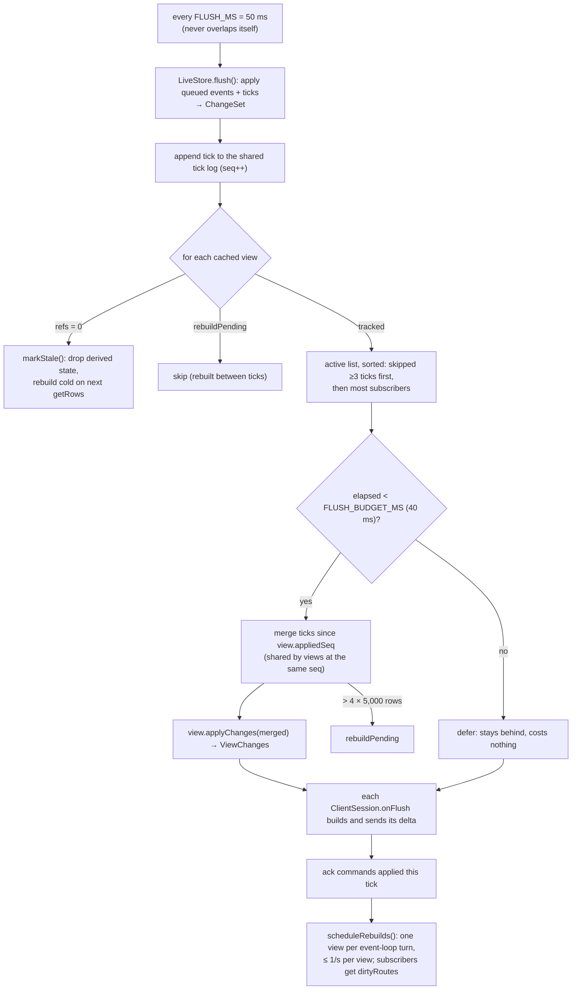

Rules, all from the CP-4 rework (R1–R3):

1. **Untracked views go stale** (R1). A view no client tracks is never patched; it drops its derived state and is
   rebuilt cold (12–47 ms, CP-2) when next requested. Maintained views = distinct views clients actually have open.
2. **No synchronous rebuild inside a flush** (R2). A view over the structural threshold is marked `rebuildPending`;
   rebuilds run after the tick's deltas are sent, one per `setImmediate`, at most once a second per view, and its
   subscribers get `dirtyRoutes` for every route they track.
3. **A 40 ms budget over a shared tick log** (R3). Views are patched most-watched first until 40 ms have elapsed; the rest
   wait. A waiting view keeps its `appliedSeq`; when patched later, the ticks it missed are merged *once* and the merge is
   shared by every view at the same `appliedSeq`. (The first implementation copied ticks into each deferred view; a
   second profile showed that copying was itself the next spiral.)
4. **`FLUSH_MS` = 50** (CP-4 ruling): at 100 ms, event age at flush p95 was 192 ms; at 50 ms, 78 ms, for about 4 points of
   median CPU.

### 4.6 Per-client block tracking and delta building

[`live/tracker.ts`](../apps/antikythera/src/live/tracker.ts) (`ClientTracker`), [`session.ts`](../apps/antikythera/src/session.ts).

The server mirrors what each grid holds: one view per client (the most recent `getRows` query), and an LRU of blocks
`routeKey#startRow → row indexes`, capped at `MAX_TRACKED_BLOCKS` (100). The grid caches at most 20 blocks of 100
(`maxBlocksInCache`), so the server never under-tracks; over-sending is harmless because the grid ignores unknown ids.

Each flush, `collect` turns the tick's `ViewChanges` into pending changes for that client; `build` produces the message:

| Change | Sent as |
|---|---|
| value-only change to a tracked row | `updates`: changed fields + `orderId`, per route |
| changed aggregate of a tracked group row | `groupUpdates` |
| new order, view sorted exactly `createdAt desc`, top block of the route tracked | `adds` with `addIndex: 0` |
| any other structural change on a tracked route | `dirtyRoutes` (client refreshes with `purge:false`, ≤ 1/s per route) |
| always (when changed) | `rowCounts` per tracked route, `newAbove` (rows inserted above the client's last root-block start), `srcTs` |
| every ~1 s | `summary` (status chips, live notional, server CPU/RSS/lag, preset) |

Tracking details that the resilience suite forced (bugs 1, 7 and 9, §11.3): rows added to a top block are followed up to
`MAX_ADDED_ROWS` = 2,000 (what the grid can hold for a route; beyond it the route is marked dirty), and when a grown block
is re-recorded the tracker keeps following up to `RETAINED_ROWS` = 1,000 rows that adds pushed past its end.

### 4.7 Backpressure and `SLOW_CONSUMER`

[`live/backpressure.ts`](../apps/antikythera/src/live/backpressure.ts). A per-client gate reads `ws.bufferedAmount` on
every flush:

| Buffered | Decision |
|---|---|
| < 1 MiB (`softBytes`) | send |
| ≥ 1 MiB | **hold**: no delta; changes keep accumulating in the tracker's pending set, values read from the store at send time, so one *conflated* delta (latest value per row) goes out when the buffer drains |
| ≥ 8 MiB (`hardBytes`), or held for 15 s (`maxSlowMs`) | **close**: `error{code:'SLOW_CONSUMER'}`, then close code 1013; the client reconnects and purges |

When a held client asks for a block while adds are pending, the delta carrying those adds is sent before the reply
(resilience bug 9). In every CP-4 run the slow consumer was cut off within 5–15 s and the other 49 clients were unaffected
([`CP-4.md`](checkpoints/CP-4.md) §6).

### 4.8 Write-behind and ack-after-persist

[`live/write-behind.ts`](../apps/antikythera/src/live/write-behind.ts). The in-memory store is the source of truth while
running; Mongo is the durable copy for restarts and for hermes's `loadCurrent()`.

- Every `WRITE_BEHIND_MS` (500 ms) a pass takes the dirty orders (lifecycle and fill changes only — **price-only changes
  are never persisted**), rebuilds full `Order`s from the store and `upsertMany`s them in chunks of 1,000, yielding
  between chunks.
- The `blotter-server` JetStream consumer uses `AckPolicy.All` and is acked **only after the pass succeeds**; a failed
  pass restores the batch and retries. A crash therefore replays exactly the events not yet persisted.
- Replays are safe because NATS events carry **absolute** post-change values (`filledQty: 4_200_000`, never `+100_000`),
  so applying one twice is an idempotent upsert.
- CP-4 R5: `ack_wait` 60 s, `max_ack_pending` 20,000, pulls bounded to 500 messages.

## 5. Protocol

Authoritative: [`packages/logos/src/protocol.ts`](../packages/logos/src/protocol.ts) and PLAN Appendix C.

### 5.1 Messages

| Client → server | Purpose |
|---|---|
| `hello{traderId, codec, clientId}` | (re)start a session: trader scope and codec; always JSON text; resets tracking |
| `getRows{reqId, req}` | one SSRM block (`startRow`, `endRow`, `rowGroupCols`, `groupKeys`, `valueCols`, `sortModel`, `filterModel`) |
| `setFilterValues{reqId, colId}` | distinct values for a set filter, trader-scoped, ≤ 5,000 |
| `command{reqId, orderId, action}` | `CANCEL` / `PAUSE` / `RESUME` |
| `control{reqId, preset}` | Dev menu: `medium` / `stress`, published on `control.load` |
| `ping{ts}` | heartbeat and clock-offset estimate |

| Server → client | Purpose |
|---|---|
| `welcome{serverTime, traders, columnsVersion, preset}` | session accepted |
| `rows{reqId, rows, rowCount, ms}` | block reply (`ms` = engine time) |
| `filterValues{reqId, values}` | set filter values |
| `delta{seq, serverTs, srcTs, updates, groupUpdates, adds, dirtyRoutes, rowCounts, newAbove}` | live changes for what the client holds |
| `summary{byStatus, liveNotionalUsd, totalRows, server{cpu, rssMb, elLagMs}, preset}` | status chips and status bar, ~1/s |
| `ack{reqId}` / `error{reqId?, code, message}` | command and request outcomes; error codes are a closed list (`UNSUPPORTED_*`, `BAD_*`, `NOT_READY`, `INVALID_TRANSITION`, `UNKNOWN_ORDER`, `SLOW_CONSUMER`, …) |
| `pong{ts, serverTs}` | heartbeat reply |

Client messages are validated with zod; server messages are not, for speed.

### 5.2 Self-describing frames and the codec trade-off

[`packages/logos/src/codec.ts`](../packages/logos/src/codec.ts). Two codecs: `json` (text frames) and `msgpack`
(`@msgpack/msgpack`, binary frames, reused encoder/decoder instances).

- **Frames are self-describing in both directions (CP-3 F1):** a receiver decodes by frame type — text is JSON, binary is
  msgpack — never by the negotiated codec. The negotiated codec only chooses what the *sender* emits. Every `hello`
  (including a mid-session re-hello) is JSON text, so switching msgpack → JSON works. (Before this rule the server decoded
  by negotiated codec and the switch back failed with `BAD_FRAME`.)
- **Trade-off (CP-4 final runs):** msgpack carries ~11% fewer bytes per client (131 vs 147 KB/s; 13% on `rows`, 5% on
  `delta`), costs slightly more server CPU (median 24% vs 22% of a core), and latency is the same within noise.
  **Default JSON** for debuggability; msgpack for constrained links.

### 5.3 Delta semantics (binding for the client)

1. Within a delta, apply **`adds` before `updates`**.
2. `updates` may contain rows whose change was structural; those routes are also in `dirtyRoutes`, so patching values then
   refreshing in the background is correct.
3. `rowCounts` lists only tracked routes whose count changed (per route, because with grouping every route has its own).
4. `newAbove` counts rows inserted above the start row of the client's last root-block request (root route only).
5. `srcTs` is the earliest source-event timestamp (hermes) folded into the delta — receipt minus `srcTs` is the true
   end-to-end tick-to-screen latency (CP-4 ruling). `serverTs` − receipt is reported separately as "last hop".
6. One view per client: the server tracks blocks of the client's current view only.

### 5.4 Command correlation

`commandId = "<clientId>:<reqId>"` ([`live/commands.ts`](../apps/antikythera/src/live/commands.ts)).

1. The server pre-checks the transition against the store (`canApplyCommand`); an impossible one is answered at once
   with `INVALID_TRANSITION` / `UNKNOWN_ORDER`.
2. Otherwise it publishes `orders.commands` with the `commandId`.
3. Hermes, the authority, answers with an `orders.events` `UPDATE` carrying the `commandId`, or a `REJECT`.
4. The server acks the client **after the flush that applied the UPDATE has sent its deltas**, so the client always sees
   the status change before the ack. A command unanswered for 5 s is an error.

Measured (phase 6, [`PHASE-6.md`](checkpoints/PHASE-6.md)): click to status on screen **p50 58 ms / p95 89 ms**; under 50
clients (CP-4 final) command ack **p50 38 ms / p95 66–67 ms**.

### 5.5 A price tick, end to end

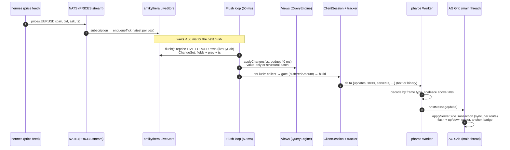

**Measured** (CP-4 final, 50 clients × 300 s incl. 60 s of stress): tick-to-screen (source `ts` → client receipt)
**p50 38 ms, p95 65 ms (json) / 62.5 ms (msgpack), p99 80 / 76 ms**; in the stress window p95 75 / 72 ms. Of that, the
last hop (`serverTs` → receipt) is only p95 22–28 ms; the rest is waiting for the 50 ms flush and NATS delivery. Browser
apply time is reported separately (~5–10 ms, CP-3).

## 6. Client internals (pharos)

### 6.1 Web Worker transport

[`transport/worker.ts`](../apps/pharos/src/transport/worker.ts), [`connection-core.ts`](../apps/pharos/src/transport/connection-core.ts),
[`client.ts`](../apps/pharos/src/transport/client.ts).

The WebSocket and the decoder live in a Web Worker, so parsing never competes with rendering. The main thread talks to it
with request/response by `reqId` (`getRows`, `setFilterValues`, `command`, `control`).

- **Heartbeat:** a `ping` every 2 s; **no frame of any kind for 6 s (3 intervals) → the socket is half open**: abandon
  it, fail in-flight requests with `DISCONNECTED`, reconnect. A socket still connecting is held to the same limit. (Added
  for resilience scenario S3; detection measured at 7.1–7.9 s.) The server pings too and terminates a client silent
  for 15 s.
- **Reconnect:** exponential backoff from 500 ms to 10 s with ±20% jitter; the reconnect re-sends `hello`, and the
  welcome purges the grid, because a new server session tracks nothing.
- **Clock offset:** NTP-style from ping/pong (lowest-RTT sample of the last 8), applied to `srcTs` for the status bar.
- **Coalescing** ([`delta-coalescer.ts`](../apps/pharos/src/transport/delta-coalescer.ts)): above 20 deltas/s the
  worker merges per animation frame (adds before updates, latest value per row and field, dirty routes unioned, latest
  `rowCounts`, `newAbove` summed, earliest `srcTs`). Held deltas are flushed **before any reply** is delivered, so a block
  reply can never overtake an older delta (resilience bug 8).

### 6.2 The AG Grid SSRM datasource

[`grid/datasource.ts`](../apps/pharos/src/grid/datasource.ts), [`grid/Blotter.tsx`](../apps/pharos/src/grid/Blotter.tsx),
[`grid/grid-options.ts`](../apps/pharos/src/grid/grid-options.ts).

- `getRows` forwards AG Grid's `IServerSideGetRowsRequest` over the worker and calls `params.success({rowData, rowCount})`.
- `cacheBlockSize` 100, `maxBlocksInCache` 20, `rowBuffer` 10, `animateRows=false` (row animation left ghost rows with
  5 inserts/s, CP-3).
- Retryable errors (`NOT_READY`, `DISCONNECTED`, and `TIMEOUT` since resilience bug 4) are retried with backoff instead of
  `params.fail()`, because nothing reloads a failed root block later.
- Set filter values come from `setFilterValues`; `wavg` is registered as a custom `aggFuncs` entry so AG Grid accepts
  the name; number and date filters set `inRangeInclusive: true` to match the server.

### 6.3 Applying deltas

[`grid/apply-delta.ts`](../apps/pharos/src/grid/apply-delta.ts) (`createDeltaApplier`).

Per delta, in order:

1. **Adds:** one synchronous `applyServerSideTransaction({route, add, addIndex: 0})` per entry.
2. **Updates:** partials for the same row in one delta are folded, then each is merged into
   `{...api.getRowNode(id).data, ...partial}` **immediately before** one synchronous transaction per route. The async
   transaction API is never used: two partials queued before an async flush would both merge against stale `node.data`
   and lose fields. Rows not loaded are skipped and counted.
3. **Group updates:** merged by group row id on the parent route.
4. **Dirty routes:** `refreshServerSide({route, purge:false})`, leading-edge, at most once per second per route.
5. **Root row count:** `setRowCount` when not grouped (AG Grid refuses it while grouped, error #28).

After a root refresh that overlapped adds, or a purge reload, the root is refreshed once more so blocks answered at
different moments can't leave a "seam" (resilience bugs 5 and 6).

### 6.4 Scroll anchoring and the badge

[`grid/anchor.ts`](../apps/pharos/src/grid/anchor.ts), [`grid/viewport-probe.ts`](../apps/pharos/src/grid/viewport-probe.ts),
[`components/NewOrdersBadge.tsx`](../apps/pharos/src/components/NewOrdersBadge.tsx).

- **Default sort (`createdAt desc`, the add path):** before applying adds, read the row at the top of the viewport;
  apply; then `ensureIndexVisible(top + shift, 'top')` where `shift` is the delta's `newAbove` (or the rows actually
  inserted when the server last saw block 0 as the top); add `shift` to the badge. At the top nothing moves and there is
  no badge. Clicking the badge scrolls to the top and clears it (`planAnchor`, a pure tested function).
- **The top row is read from the rendered DOM**, not computed from `scrollTop`: with 1M rows AG Grid caps the scroll
  container at ~16M px and scales the position (scrolling to 6,400 px landed on row 413 in CP-3).
- **Any other sort (the refresh path):** rows can't be placed precisely, so the server marks the root dirty and the
  client refreshes. Just before the refresh it notes the order at the top; on `storeRefreshed` it finds that order and
  scrolls to it (`ANCHOR_SLACK_ROWS` 25 guards against a ticking sort key reordering the view). Residual: about one row
  of drift on the first refresh after scrolling (CP-5).
- **Across a reconnect (CP-6 F1):** the grid saves the first visible row and order before the purge and restores them
  when the reloaded root reports its size; the badge counts orders that arrived meanwhile.

Measured (CP-3 review, DevTools): anchored at row **312,710** for 15 s, the same order stayed at the top while 75 orders
arrived above it (index 312,710 → 312,785), badge 20 → 95.

### 6.5 Cell flash and up/down colour

`HighlightChangesModule`, `enableCellChangeFlash` in `defaultColDef`, flash 600 ms / fade 400 ms. Price columns
(`ColumnMeta.priceColumn`) get `cellClassRules` `tick-up` / `tick-down` driven by
[`grid/tick-tracker.ts`](../apps/pharos/src/grid/tick-tracker.ts) (previous value, direction, 600 ms hold); expiry
refreshes only those cells. No whole-row re-render.

### 6.6 Status bar and summary chips

[`components/StatusBar.tsx`](../apps/pharos/src/components/StatusBar.tsx), [`SummaryStrip.tsx`](../apps/pharos/src/components/SummaryStrip.tsx),
[`metrics/`](../apps/pharos/src/metrics).

- **Summary strip** (under the header): LIVE, PENDING_START, PAUSED, FILLED, CANCELLED counts and live notional, scoped to
  the trader (and filter).
- **Status bar:** connection state (with reconnect attempt), a `STRESS` pill while stress is on, codec, Rows (server total;
  plus Groups when grouped), RTT, FPS, **tick-to-screen p50/p95** (rolling 10 s, from `srcTs`, clock-offset corrected),
  deltas/s, rows updated/s, msgs in/out per second, server CPU, RSS and event-loop lag.

## 7. Simulation and data

### 7.1 gaia: seeding

`docker compose --profile core --profile seed run --rm gaia`. Deterministic (`SEED`, optional `SEED_NOW` pins the clock),
batches of 10,000, skips if already seeded; `SEED_RESET=true` drops and re-seeds a window anchored to today.
[`scripts/loadtest-reset.sh`](../scripts/loadtest-reset.sh) uses it to restore a known 1M-row state with an empty
JetStream (about 45 s).

### 7.2 hermes: the order lifecycle

[`apps/hermes/src/simulator.ts`](../apps/hermes/src/simulator.ts), [`price-feed.ts`](../apps/hermes/src/price-feed.ts),
[`presets.ts`](../apps/hermes/src/presets.ts); lifecycle maths shared in [`packages/logos/src/lifecycle.ts`](../packages/logos/src/lifecycle.ts)
(`applyFill`, `transition`, `canApplyCommand`).

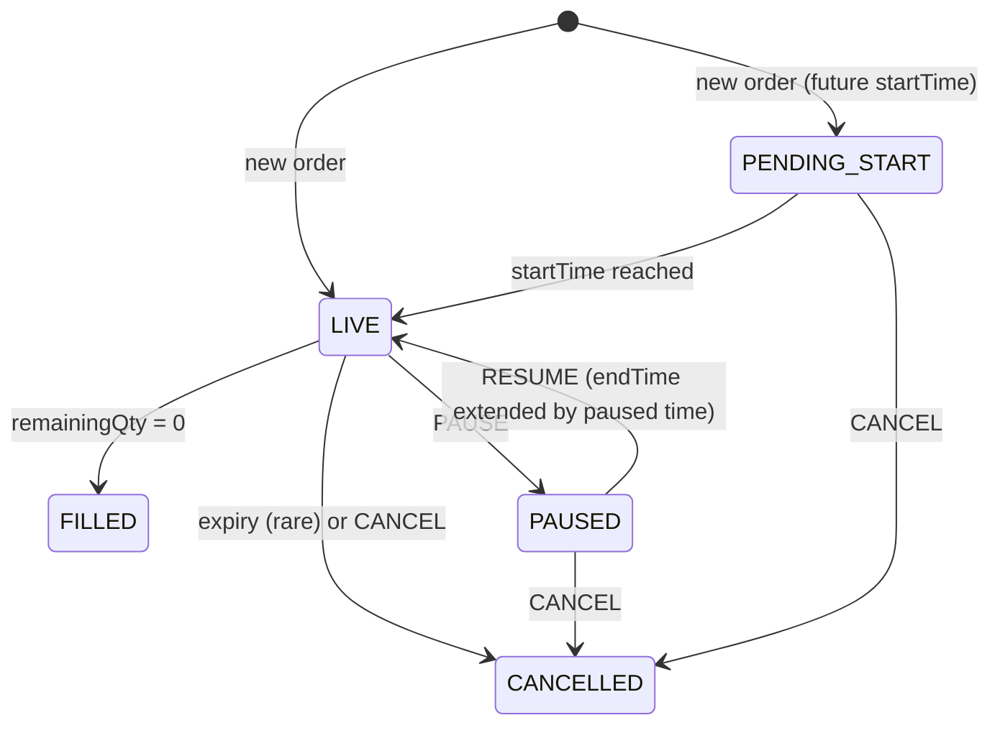

- **Startup:** reads `loadCurrent()` (LIVE, PAUSED, PENDING_START) and `maxOrderId()`; starts each pair's random walk
  from the seeded current mid (so LIVE rows don't jump on the first tick); **reconciles** stale current orders (LIVE past
  `endTime` → FILLED, or CANCELLED with p = 0.08; PENDING past `startTime` → LIVE) and tops LIVE back up, all published as
  ordinary events.
- **Price feed:** 20 pairs, 3 ticks/s each, `prices.<PAIR>` (PRICES stream keeps 1 message per subject).
- **Presets** (live-switchable via `control.load`; current preset announced on `control.state` every 5 s):

| Preset | Updates/s | New orders/s | LIVE target / cap | Fills per order |
|---|---|---|---|---|
| medium | 100 | 5 | 500 / 600 | 32 |
| stress | 2,000 | 50 | 3,000 / 5,000 | 64 |

- New order ids ascend above the current maximum, keeping `store.idsAscending` true (free radix tiebreak).
- Commands: valid ones produce an `UPDATE` with `commandId`; invalid ones a `REJECT`; stale redeliveries (> 30 s) are
  dropped.

## 8. Observability

### 8.1 Metrics catalogue

antikythera `GET :4000/metrics` ([`metrics.ts`](../apps/antikythera/src/metrics.ts)); labels are small fixed sets, never
client or order ids (full table: [`CP-4.md`](checkpoints/CP-4.md) §2).

| Area | Metrics |
|---|---|
| Process | prom-client defaults; `apeiron_process_cpu_percent`; `apeiron_event_loop_lag_seconds{quantile}` |
| Connections & traffic | `apeiron_ws_connections`, `apeiron_ws_clients{codec}`, `apeiron_ws_messages_total` / `_bytes_total{direction,type,codec}` |
| Flush & views | `apeiron_flush_duration_seconds`, `apeiron_flush_views_total{outcome=patched|deferred|unsubscribed|pending_rebuild}`, `apeiron_views_stale`, `apeiron_views_rebuild_pending`, `apeiron_view_rebuild_duration_seconds`, `apeiron_view_cache_*` |
| Latency | `apeiron_getrows_duration_seconds{temp,shape}`, `apeiron_event_age_at_flush_seconds`, `apeiron_event_age_at_send_seconds`, `apeiron_delta_bytes`, `apeiron_command_duration_seconds{outcome}` |
| Ingest & persistence | `apeiron_ingest_events_total{type}`, `apeiron_ingest_queue_depth`, `apeiron_live_rows`, `apeiron_write_behind_*` |
| Health | `apeiron_backpressure_events_total{event=soft_conflate|slow_consumer}`, `apeiron_errors_total{code}`, `apeiron_commands_pending`, `apeiron_store_rows` |

hermes `:4100/metrics`: `hermes_events_published_total{type}`, `hermes_price_ticks_total`, `hermes_live_orders`,
`hermes_preset{preset}`, publish errors and in-flight. `GET :4000/debug/lag` gives flush, lag and write-behind figures.

### 8.2 Grafana

Prometheus scrapes every 2 s; Grafana (`:3001`, anonymous viewer, local only) has a provisioned dashboard **"Apeiron:
Blotter Server"** (41 panels, red lines at the POC targets): CPU, RSS, event-loop lag, connections, traffic by message
type and codec, flush duration and view outcomes, getRows cold/warm, event age at send, backpressure, write-behind.

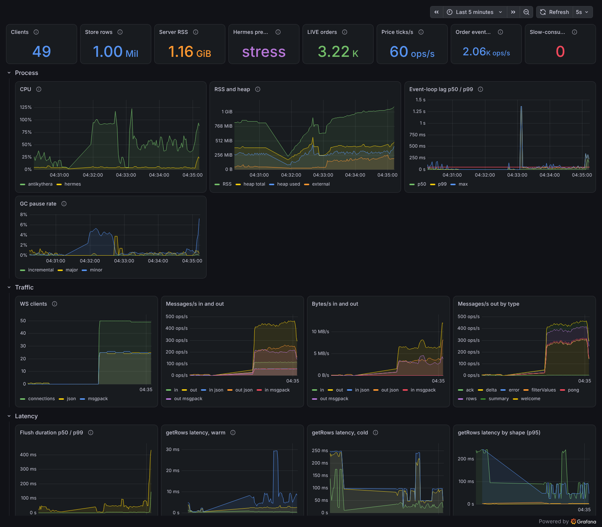

### 8.3 talos: the load-test method

[`apps/talos`](../apps/talos) ([`CP-4.md`](checkpoints/CP-4.md) §3).

- **Clients (seeded):** each picks a trader, a flat or grouped view (40% grouped), a sort and a filter (continuous
  thresholds, so most views are unique); scrolls 2 blocks/s with jitter; changes view about every 45 s; sends a Pause or
  Resume about every 10 s.
- **Special clients:** a slow consumer (stops reading at 20% of the run, requests 2,000-row blocks until cut off, then
  reconnects); a codec switcher (re-hello every 20 s, checks frame types); a controller that switches hermes to stress
  from 120 s to 180 s.
- **Open loop, no coordinated omission:** each request stream has a fixed timeline; a slot already past due goes out at
  once, and latency = response time − **intended** send time, so a stalled server cannot hide its own delay. The
  generator's own send lag and event-loop lag are reported (p99 2 ms) so a slow generator can't pass for a slow server.
- **Reports:** console tables plus `loadtest/results/<ts>-<codec>.json|.md`: latency percentiles, tick-to-screen (from
  `srcTs`) and last hop, startup burst (first view of all clients at once, reported separately and not gated), traffic per
  client, server CPU/RSS/lag scraped from `/metrics`, server-side histograms, and a PASS/FAIL table against the targets.

## 9. Performance results

### 9.1 The headline: CP-4 final runs

Source: [`CP-4.md`](checkpoints/CP-4.md) §12.1 (raw output §12.2–12.3). 50 clients × 300 s, 1M rows, Medium preset with a
60 s stress window (120–180 s: ~2,000 order updates/s, up to ~5,000 LIVE rows), `FLUSH_MS=50`, one laptop (Apple silicon,
6 GB Docker VM), each run after `scripts/loadtest-reset.sh`.

| Measure | JSON | msgpack | Target | |
|---|---|---|---|---|
| **Tick-to-screen** p50 / p95 / p99 (source event → client) | 38 / **65** / 80 ms | 38 / **62.5** / 76 ms | p95 < 150 ms | ✅ |
| Tick-to-screen p95, stress window | 75 ms | 72 ms | | |
| Last hop (`serverTs` → receipt) p50 / p95 | 4.5 / 28 ms | 4 / 22 ms | | |
| **getRows warm** p50 / p95 / p99 | 5.1 / **18.0** / 31.2 ms | 5.5 / **18.1** / 27.2 ms | p95 < 50 ms | ✅ |
| **View change (cold)** p50 / p95 / p99 | 16.8 / **37.7** / 52.0 ms | 16.8 / **38.2** / 46.7 ms | p95 < 300 ms | ✅ |
| getRows cold, server side p95 | 32.7 ms | 35.9 ms | | |
| Startup burst (50 cold views at once) p50 / p95 / max | 83 / 207 / 265 ms | 194 / 380 / 445 ms | not gated (< 2 s) | |
| **Event-loop lag** p99 / p99.9 / longest stall | **23.1** / 35 / 216 ms | **19.0** / 31.8 / 346 ms | p99 < 50 ms | ✅ |
| Server CPU median (max), % of one core | 22% (112%) | 24% (114%) | | |
| **Server RSS** median (max) | 1,040 (1,099) MB | 1,019 (1,065) MB | max < 2,048 MB | ✅ |
| Command ack p50 / p95 | 37.7 / 66.5 ms | 37.8 / 66.3 ms | | |
| Flush p50 / p99 (server histogram) | 1.13 / 44.2 ms | 1.15 / 36.0 ms | | |
| Bytes in per client | 147 KB/s | 131 KB/s (−11%) | | |
| Messages in per client | 9.3 /s | 9.2 /s | | |
| Requests timed out | 0 | 0 | | |

A **600 s soak** (both codecs, 240 s of stress) ran without a stall: event-loop p99 26.1 ms, RSS max 1,114 MB
([`CP-4.md`](checkpoints/CP-4.md) §5.3).

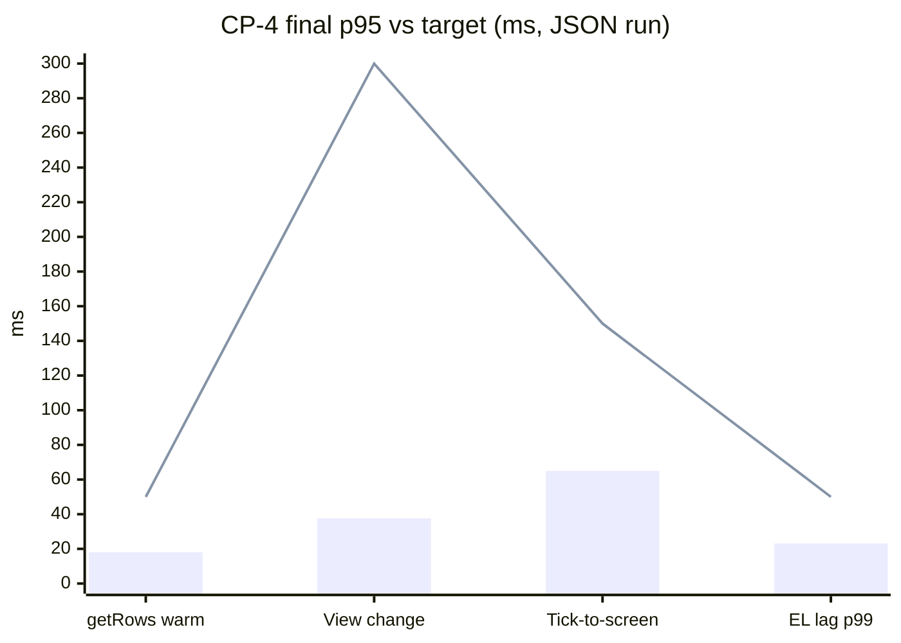

### 9.2 JSON vs msgpack

| | JSON | msgpack |
|---|---|---|
| Bytes in per client | 147 KB/s (`rows` 111, `delta` 36) | 131 KB/s (`rows` 97, `delta` 34) |
| Tick-to-screen p95 | 65 ms | 62.5 ms |
| getRows warm p95 | 18.0 ms | 18.1 ms |
| Server CPU median | 22% | 24% |
| Startup burst max | 265 ms | 445 ms |

Conclusion (CP-4): ~11% fewer bytes, slightly more server CPU, same latency. Either is fine; JSON is the default.

### 9.3 Browser figures

Source: [`CP-3-review.md`](checkpoints/CP-3-review.md) (Chrome DevTools, 1600×900, DPR 2, 120 Hz display) and
[`CP-3.md`](checkpoints/CP-3.md).

| Scenario | Result |
|---|---|
| Default view, Medium | 120 FPS; tick-to-screen p50/p95 5/10 ms (pre-`srcTs`, last hop) |
| Fast scripted scroll to ~row 300,000 | 103 FPS average, p95 frame 10.1 ms, one 142 ms frame (a block fetch), no long tasks |
| Stress preset (~3,980 LIVE, ~51 new orders/s) | 112–114 FPS; server CPU 6–9%, RSS 844 MB |
| Stress, msgpack, top of grid (950–1,300 rows updated/s) | 115–120 FPS |
| Stress with programmatic scrolling | 81–111 FPS (CP-3) |
| JS heap | 27 MB Medium, 48 MB after Stress |
| Console | AG Grid licence banner only |
| Order action, click → status on screen | p50 58 ms, p95 89 ms (phase 6) |

### 9.4 Fresh run, 2026-10-09

Raw output and environment: [`checkpoints/PHASE-10.md`](checkpoints/PHASE-10.md). **These runs were on a different,
slower host than CP-4** — a 4-vCPU KVM cloud container (Intel Xeon @ 2.80 GHz, no GPU) running the whole stack, the load
generator and the browser — not the Apple-silicon laptop. They are a reproduction, not a replacement for §9.1.

| Run | Result |
|---|---|
| `pnpm e2e` | **18 / 18 passed** (1.9 min) |
| `pnpm e2e:resilience:quick` | **not re-run**: the Toxiproxy image could not be downloaded under this session's network policy. The final results in §11.2 (merged code) stand |
| Engine bench, cold default view / warm block fetch | 116.6 ms / 0.68 ms (CP-2 laptop: 24.5 / 0.109 ms) — this host is **3.9–7× slower** per operation |
| Store load, 1M rows | 44.8–51.4 s (laptop 9.4–9.5 s) |

**talos, 50 clients × 300 s, both codecs** (25 each; stress 120–180 s; after `loadtest-reset.sh`):

| Measure | JSON | msgpack | Target | |
|---|---|---|---|---|
| Tick-to-screen p50 / p95 / p99 | 56 / 420 / 643 ms | 57 / 401.5 / 626 ms | p95 < 150 ms | ❌ |
| Tick-to-screen p95 by phase: baseline / stress / after | 103 / 692 / 235 ms | 103 / 672 / 220.5 ms | | |
| getRows warm p50 / p95 | 9.1 / 260.4 ms | 9.9 / 257.5 ms | p95 < 50 ms | ❌ |
| View change (cold) p95 | 352.5 ms | 226.8 ms | p95 < 300 ms | ❌ / ✅ |
| Startup burst p50 / p95 / max | 480 / 1,723 / 1,797 ms | 455 / 1,604 / 1,697 ms | not gated (< 2 s) | |
| Event-loop lag p99 / p99.9 / longest stall | 193.3 / 441.7 / 1,362.6 ms (whole run) | | p99 < 50 ms | ❌ |
| Server CPU median (max) | 65.3% (215.4%) of one core | | | |
| Server RSS median (max) | 1,301 (1,503) MB | | < 2,048 MB | ✅ |
| Flush p50 / p99 | 6.4 / 238 ms | | | |
| Command ack p50 / p95 | 61.4 / 772.7 ms | 60.5 / 843.3 ms | | |
| Bytes in per client | 159.1 KB/s | 134.0 KB/s (−16%) | | |
| Requests timed out | 0 | 0 | | |

What this shows:

- **On a host 4–7× slower per operation, the same code misses four of five targets.** Server CPU median rose from 22–24%
  to 65% of a core and flush p99 from 36–44 ms to 238 ms; latency follows. The design still degrades gracefully: no
  timeouts, no wedge after the stress window, the slow consumer was cut off (`SLOW_CONSUMER`) and reconnected, and the
  baseline-phase tick-to-screen p95 (103 ms) is within target. Capacity is CPU-bound on one thread — exactly what the
  `worker_threads` next step (§13) addresses.
- **The laptop figures in §9.1 remain the reference** for "what the POC proved". A run on the intended target host (AWS
  Graviton `t4g.xlarge`) has not been made.
- msgpack again carried fewer bytes (−16% here, −11% in CP-4) at the same latency.

**Browser pass** (Playwright + CDP at 1600×900; the chrome-devtools MCP was not available in this session; headless
Chromium 141 with software rendering, capped at 60 FPS):

| Check | Result |
|---|---|
| Flat view, Medium | 60 FPS (the cap), p95 frame 16.8 ms; status bar tick-to-screen p50/p95 22/63 ms; JS heap 25.6 MB |
| Deep scroll to row ~300,000 (40 steps, ~2 s) | 31.6 FPS, p95 frame 83 ms, 10 long tasks (longest 111 ms) — software rendering; laptop: 103 FPS, no long tasks |
| Anchoring for 15 s at row 300,193 | **same order (`ALG00700432`) held at the top** while 75 orders arrived above (index → 300,268); badge 34 → 109; badge click → row 0, cleared |
| Grouping by pair, LIVE drilled | 20 groups, aggregates ticking, 60 FPS |
| Filters: pair = EURUSD → notional > 10M → value date = 2026-11-09 | 1,000,923 → 250,782 → 76,410 → 43 rows |
| Pause / Resume, click → status on screen (10 samples) | p50 87 ms, max 118 ms (target 500 ms) |
| Codec switch msgpack ↔ JSON | both directions, deltas kept flowing (11/s) |
| Stress preset | STRESS pill shown; ~4,000 rows updated/s; 37 FPS idle, 5.5 FPS while scrolling (software rendering) |
| JS heap under Stress | 101.7 MB before GC, 25.3 MB after |
| Console | AG Grid licence banner only (7 lines per page load) |

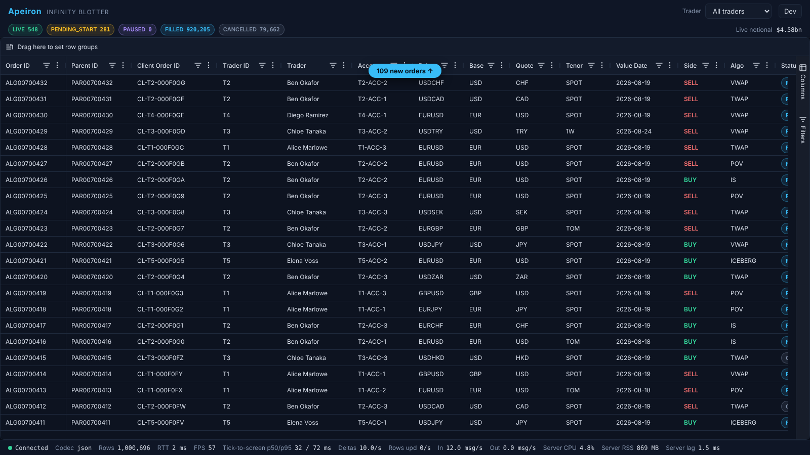

## 10. The death spiral (CP-4)

The most important lesson of the POC. Sources: [`CP-4-diagnosis.md`](checkpoints/CP-4-diagnosis.md),
[`CP-4.md`](checkpoints/CP-4.md) §4, [`CP-4-review.md`](checkpoints/CP-4-review.md).

**Symptom.** The first 50-client × 300 s run: stress started at 120 s; by ~140 s event-loop stalls of 2.7 s then 13 s;
from 180 s every request timed out (15 s client timeout) — **13,272 timeouts** — and the server stayed wedged for about
2 minutes *after* stress ended. Average CPU was only ~25%.

**Profiling.** antikythera under `node --cpu-prof`, driven by talos (50 clients, 100 s, stress from 40 s). Stress-window
busy time: `flush → View.applyChanges → patch/applyLeaf` **60% inclusive**; the sort comparator `rank` 15% self;
`getRows` 13%; encoding 5%. Client-measured cold `getRows` p95 was 599 ms against 44 ms server-measured: requests were
queueing behind flush work. Steady state was fine; this was a **feedback loop, not overload**.

**Root cause.**

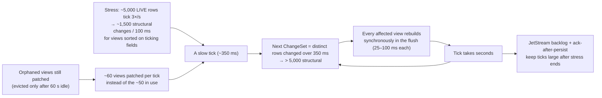

**Fix** (R1–R3, R5; §4.5): untracked views go stale; no synchronous rebuild in a flush (deferred, throttled, one per
event-loop turn); a 40 ms budget, most-watched views first, with skipped ticks in a **shared** log merged once per
`appliedSeq`. The agent's first R3 version copied ticks into every deferred view — its own profile of a second stall
showed the copying was the next spiral, and the shared log replaced it. R4 (cheaper comparator) was not needed: `rank`
fell to ~2% of a core.

**A second, environmental cause.** With the flush fixed, a 600 s soak still stalled (84 s, 182 s). The CPU profile
showed nothing unusual; `/proc/pressure/memory` showed memory stalls 60–76% of the time and swap full. MongoDB's
WiredTiger cache defaults to half the VM's RAM; on a shared 6 GB VM, write-behind pushed it into swap and every container
stalled together. Fix: `--wiredTigerCacheSizeGB 1` (`MONGO_CACHE_GB`).

**Before and after** (50 clients, 300 s, json; [`CP-4.md`](checkpoints/CP-4.md) §4.4, "after" at `FLUSH_MS=100`):

| | Before (`c4845aa`) | After | Target |
|---|---|---|---|
| getRows warm p95 | 15,002 ms (timeouts) | 17.4 ms | < 50 ms |
| View change (cold) p95 | 15,002 ms | 110 ms | < 300 ms |
| Event-loop lag p99 | 2,179 ms (worst 1 s window) | 17.8 ms | < 50 ms |
| Flush p99 | 192 ms | 44 ms | |
| Requests timed out | 13,272 | 0 | |
| Server RSS max | 1,171 MB | 1,035 MB | < 2,048 MB |

**Then the latency ruling.** With the server healthy, the review asked what "tick-to-screen" means. The last hop was
21–25 ms p95, but the oldest event waited 151–193 ms p95 before its flush ran. Ruled **end to end** (source event to
client); meeting that needed `FLUSH_MS=50` (event age at flush p95 192 → 78 ms, for ~4 points of CPU) and `delta.srcTs`
to measure it honestly. Final: p95 62.5–65 ms.

**Lessons.**

- Measure latency from the *intended* send time; a closed-loop generator would have hidden the collapse.
- Bound work per tick by time, not by count; work that can't fit must cost nothing while it waits.
- Don't maintain state nobody reads.
- A "same author" profile can mislead: profile the fix too (the per-view carry copies).
- Check the environment (memory pressure) before blaming the code.
- Agree what a latency target measures before claiming it.

## 11. Testing strategy

Full detail: [`TESTING.md`](TESTING.md).

### 11.1 The pyramid

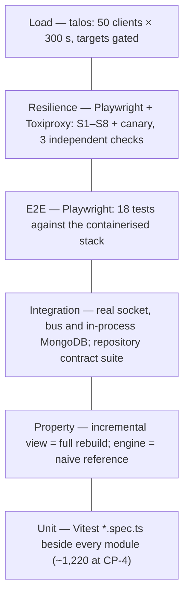

| Layer | Question | Where | Command |
|---|---|---|---|
| Unit | Does this module do what it says? | `*.spec.ts(x)` beside the source | `pnpm test` |
| Property | Does the incremental engine agree with a simple reference on random data? | `apps/antikythera/src/query/*.property.spec.ts` | `pnpm test` |
| Integration | Do the pieces work over a real socket, bus and DB? | `server*.spec.ts`, `session*.spec.ts`, mnemosyne contract suite | `pnpm test` |
| E2E | Does the browser show the right thing for a user's actions? | [`e2e/tests/*.e2e.ts`](../e2e/tests) | `pnpm e2e` |
| Resilience | After the network breaks, is the grid complete and current? | [`e2e/tests/resilience/`](../e2e/tests/resilience) | `pnpm e2e:resilience[:quick|:smoke]` |
| Load | What does it cost, and how late is a tick? | [`apps/talos`](../apps/talos) | `pnpm --filter @apeiron/talos start` |

Unit test counts at CP-4 (raw, [`CP-4.md`](checkpoints/CP-4.md) §12.4): antikythera 434, pharos 381, logos 156, talos 123,
hermes 60, mnemosyne 35, gaia 25, iris 9 (+2 needing NATS). The e2e support code has 70 more (CP-6).

### 11.2 The resilience suite (phase 9, merged — final results)

**Goal:** after any disruption the grid shows **complete, current data** — no missed updates, stale values, wrong
counts or aggregates, and no value moving backwards.

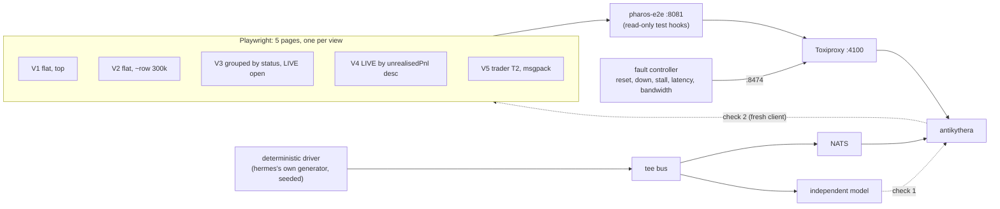

- **Faults:** Toxiproxy between the browser's web container and antikythera: clean reset (`reset_peer`), proxy down for
  N s, half-open stall (`timeout` toxic: data stops, nothing closes), latency with jitter, bandwidth limits.
- **Deterministic driver** ([`e2e/support/driver.ts`](../e2e/support/driver.ts)): hermes's own `startHermes` in the test
  process with a seeded generator, so the stream is hermes's (ticks, fills, transitions, new orders, PAUSE/RESUME via the
  command path). Every event passes through a **tee bus** that applies it to an independent model
  ([`model.ts`](../e2e/support/model.ts)) before forwarding. The real hermes is stopped during a run.
- **The three checks** (after the stream stops and everything is quiet; [`oracle.ts`](../e2e/support/oracle.ts),
  [`sampler.ts`](../e2e/support/sampler.ts)):
  1. **Model vs server.** A fresh protocol client reads every created and touched order; every field must equal the
     model (except `lastUpdateTime`, the server's clock, and the quote fields of orders closed within a flush window).
  2. **Server vs screen.** Every row each page holds must equal a fresh server read at the same position, field for field
     including `lastUpdateTime`; plus the root row count, group `childCount`s and aggregates (relative 1e-9), and the
     status chips.
  3. **Invariants + minimums.** A sampler in each page every 500 ms: `filledQty`, `numFills`, `lastUpdateTime` never go
     backwards; a FILLED/CANCELLED order never shows LIVE again. Each scenario must observe a minimum number of
     reconnects and deltas, so it cannot pass vacuously.
- **A canary** freezes a page below the heartbeat threshold and requires check 2 to *fail*, then pass once caught up: the
  suite is proven able to fail.
- **Independence caveat (documented):** for open orders the model computes quote fields with logos's
  `derivePriceFields`, the same function the server uses; a bug inside it would pass check 1 (check 2 still compares
  screen with server).

| ID | Scenario | Faults (full tier) |
|---|---|---|
| S1 | Steady drops (the user's required scenario) | 10 drops, 30 s apart: clean reset, down 3 s, down 10 s |
| S2 | Rapid flapping | drops every 2–5 s for 2 min, timed into getRows, hello, trader and codec switches |
| S3 | Half-open stall | `timeout` toxic 20 s, 3 times; detection must take 5.0–9.5 s |
| S4 | Long outage in a burst | proxy down 60 s at the stress rate; V2 must return to its old depth |
| S5 | High latency | 300 ± 100 ms each way for 3 min, plus 2 drops |
| S6 | Low bandwidth | 64 KB/s for 3 min, then 16 KB/s for 1 min at stress (must trigger `SLOW_CONSUMER`) |
| S7 | Server restart | `docker compose restart antikythera`, twice; JetStream replay proves no event lost |
| S8 | Command across a drop | Pause/Cancel, then drop before the ack; no hang, final grid matches server |

**Tiers** (one table, [`e2e/support/tiers.ts`](../e2e/support/tiers.ts)): `quick` (standard, all 8 shortened, ~12 min),
`full` (releases and demos, ~24 min), `smoke` (CI: S1 60 s + S3 once, ~3 min). Verification strictness is the same in all.

**Final results on the merged code** ([`TESTING.md`](TESTING.md), "Latest results"; [`CP-6.md`](checkpoints/CP-6.md)):
full tier **9/9 in 23.6 min**, quick tier **9/9 in 11.9 min**, smoke green in CI. Full-tier highlights: S1 10 reconnects
per page, 2,272 orders compared, tick-to-screen p95 57–64 ms; S3 stall detection 7.1–7.9 s; S4 7,598 orders compared;
S6 `SLOW_CONSUMER` fired, throttled-link p95 up to 31 s, then correct; S7 4,230 orders compared after two restarts.

### 11.3 Bugs the resilience suite found

All nine were real product bugs in the live path, found against the 1M-row stack, each fixed with a reproducing unit
test; none was caught by the unit, property or E2E layers ([`CP-6.md`](checkpoints/CP-6.md) §2 and "CP-6 fixes"). The
handoff's "7 bugs" predates bugs 8 and 9, found after the CP-6 review.

| # | Bug | Found by | Fix |
|---|---|---|---|
| 1 | Tracker kept only 500 rows added to a top block; older rows still on screen stopped ticking | S4 | track up to 2,000; beyond that mark the route dirty |
| 2 | A client that said hello while the store was loading was never registered for deltas after a restart | S7 | register the session on `getRows` once the runtime exists |
| 3 | `lastUpdateTime` stepped backwards from producer/server clock skew | S5 | never lower an order's `lastUpdateTime` |
| 4 | A timed-out `getRows` failed the block and left the grid empty for good | S6 | `TIMEOUT` is retryable |
| 5 | Root-refresh seam: rows added between block answers left displaced rows | S6 | refresh the root once more after a refresh that overlapped adds |
| 6 | Same seam after a purge reload; adds the grid couldn't take yet were lost | S6 quick | arm the follow-up refresh on purge too |
| 7 | Rows pushed past a reloaded block's end went untracked and stale | S2 (~1 run in 4) | carry the previous tail when re-recording a grown block |
| 8 | A held delta could be overtaken by a later reply, so adds were applied twice | S6 (after F1) | flush held deltas before any reply |
| 9 | Rows below a slow reload went untracked; held-back adds arrived after a reply that already contained them | S4/S5/S6 | retain 1,000 rows; send pending adds before a reply |

The common cause: tracked blocks mirror a client cache the server cannot see. The fixes make it self-healing (reload when
unsure) rather than exact (CP-6 §7).

## 12. Decisions and trade-offs

From PLAN.md's decisions table and "Decisions log", and the review files.

| Decision | Alternatives | Why |
|---|---|---|
| **Server-side SSRM**: server holds all rows, does sort/filter/group/agg; client lazily loads 100-row blocks | Client-side row model with all rows in the browser; viewport row model | Grouping with aggregates over 1M rows is required; 1M × 50 in each browser is ~1.5 GB of objects; one server view is shared by many clients |
| **AG Grid Enterprise 36**, watermark accepted | Community grid; a custom grid | SSRM and row grouping are Enterprise features; no licence key in a public repo |
| **Columnar typed arrays on SharedArrayBuffer**, dictionary-encoded strings | JS objects; an embedded DB | ~260 MB of typed arrays vs ~1.5 GB of objects; contiguous scans; SAB keeps a worker-thread fallback a drop-in |
| **LSD radix sort over Float64 bit patterns**, ranks for enums/strings | `Array.prototype.sort` with a comparator | 1M-row sorts in ~25–30 ms; stable, so the `orderId` tiebreak is free while ids ascend |
| **Incremental view maintenance** from a per-tick ChangeSet | Rebuild affected views ≤ 1/s (Appendix F fallback) | Value updates at 50 ms without rebuilding; property-tested equal to a rebuild |
| **Budgeted flush (40 ms), untracked views stale, deferred rebuilds, shared tick log** (CP-4) | Synchronous patch-everything; `worker_threads` pool | Fixed the death spiral on one thread; worker fallback not needed |
| **`FLUSH_MS` 50** (CP-4) | 100 ms (original) | End-to-end p95 from ~220 ms to ~65 ms for ~4 points of CPU |
| **Tick-to-screen measured end to end via `delta.srcTs`** (CP-4) | Last hop (`serverTs` → receipt) | That's what a trader experiences |
| **NATS JetStream**, absolute idempotent events, ack after persist | Kafka; direct DB polling; increments | Durable replay after restart; idempotent upserts make replay safe |
| **Write-behind, lifecycle fields only** | Persist every tick | Price ticks would be ~15k writes/s under stress; cost: `lastUpdateTime` steps back briefly after a restart |
| **Fastify + `ws`, transport behind an interface** | uWebSockets.js | Mainstream and fast enough; uWS stays swappable |
| **Self-describing frames**, JSON default, msgpack toggle (CP-3) | Decode by negotiated codec; msgpack only | Fixed the codec-switch bug; JSON debuggable; msgpack −11% bytes |
| **Web Worker owns the socket and codec** | Main-thread WebSocket | Decode never blocks rendering |
| **Synchronous `applyServerSideTransaction`** with merge-before-apply | Async transactions | Async merges partials against stale data and loses fields |
| **Anchor from the rendered DOM** | `scrollTop / rowHeight` | AG Grid scales the scroll position past ~16M px |
| **One tracked view per client**, block LRU mirroring the grid | Server-side cursor; snapshot diffs | Simple and bounded; resilience suite hardened it (bugs 1, 7, 9) |
| **Mongo full adapter; Oracle/KDB interface + contract suite + docs only** | Build all three | POC scope; `OrderRepository` contract keeps them pluggable ([`db-adapters.md`](db-adapters.md)) |
| **Toxiproxy + independent model + three checks** (CP-6) | Unit-level fault injection; trusting the system under test | Proves sync end to end through real sockets; found 9 bugs |
| **Every service in a container**; same compose file locally and remotely; AWS EC2 Graviton on demand | ECS Fargate + ALB + Atlas (~$250+/month) | ~$0.16/hr while testing; nothing billed between sessions |
| **`MONGO_CACHE_GB=1`** on 6 GB hosts | Mongo default (½ RAM) | Default swapped the VM and stalled everything (CP-4) |
| **Latest stable versions**, exceptions recorded | Pin older | TypeScript 6.0.x (7 blocked by typescript-eslint), `@types/node` ^24 to match the runtime |

## 13. Limitations and next steps

### Known limitations

| Limitation | Detail | Source |
|---|---|---|
| **Non-default-sort anchoring drift** | Under a sort other than `createdAt desc`, rows arrive by background refresh; the first refresh after scrolling can drift about one row | CP-5 review |
| **Connect-storm cold burst** | 50 clients opening cold views at the same instant queue on one thread: startup burst max 265 ms (json) / 445 ms (msgpack) | CP-4 §12.1 |
| **Rare long stalls** | Single event-loop stalls of 200–350 ms show in the longest-stall figure (p99 stays 19–23 ms) | CP-4 §12.1 |
| **`lastUpdateTime` after a restart** | Price-driven changes aren't persisted, so after a server restart an open order's update time steps back for under a second until the next tick | CP-6, TESTING.md |
| **Saturated links** | At 16 KB/s the client's heartbeat gives up before the server does; tick-to-screen reaches 20 s+ while throttled | TESTING.md |
| **Tracking bound** | The server follows at most 2,000 rows below the top of a route; rows beyond that in an unrefreshed cache would go stale (not observed) | TESTING.md |
| **`getRowNode` is a linear scan** in SSRM | Cheap at ≤ 2,000 cached rows; won't scale to a much larger client cache | CP-3 |
| **Single node, no auth** | Trader scope is whatever `hello` says | PLAN |
| **AWS untested** | Terraform and `remote-*` scripts validated (`terraform validate`, `shellcheck`) but never applied; AWS work paused by the user | CP-5 review |

Phase 9 has no open items: CP-6 F1–F4 and bugs 8–9 are fixed and merged. The S8 harness failure "12 publishes failed"
was seen once and not reproduced; the driver now retries per order and reports the cause (CP-6).

### Next steps

1. **AWS deploy** (user's decision): choose GHCR (public packages) or ECR, protect the GitHub `release` environment, run
   `scripts/remote-up.sh` (~$0.16/hr), then re-run talos on the Graviton box with `MONGO_CACHE_GB` raised.
2. **Oracle and KDB adapters:** implement `OrderRepository` and run the existing contract suite
   ([`db-adapters.md`](db-adapters.md) has the DDL and schema sketches).
3. **Worker threads if needed:** the store is already on `SharedArrayBuffer`; move cold view builds and rebuilds to a
   `worker_threads` pool if more clients, more distinct views or the connect storm demand it.
4. **Anchoring under non-default sorts:** a server-computed position for the client's top order would remove the
   one-row drift.
5. **Exact client tracking:** a server-side record of what the grid really holds (or a periodic reload) instead of the
   self-healing heuristics, if more tracking bugs appear.
6. **Production hardening:** authentication and entitlements per trader, horizontal scale (shard by trader or replicate
   the store behind a bus fan-out), and persistence of the last price per order if a restart must not step back.
