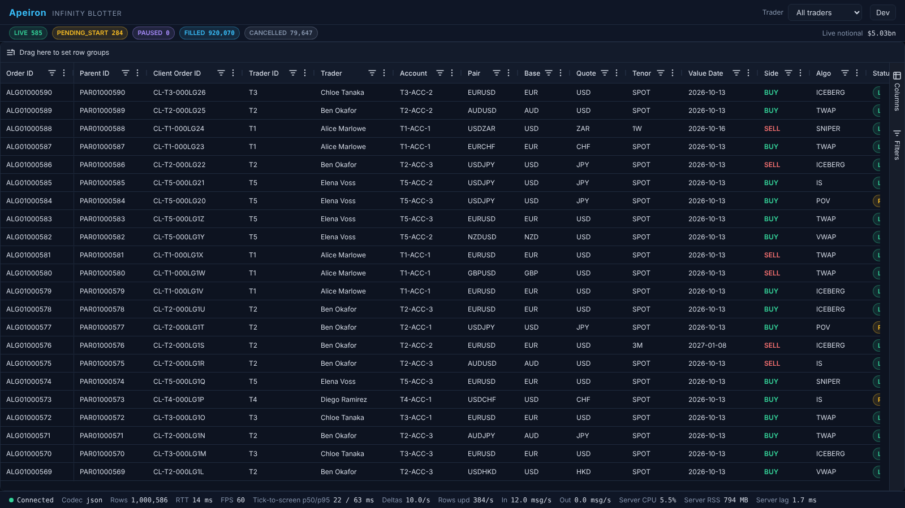
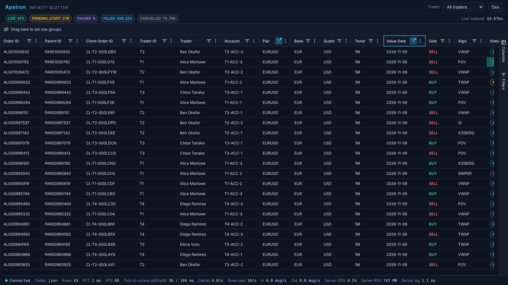
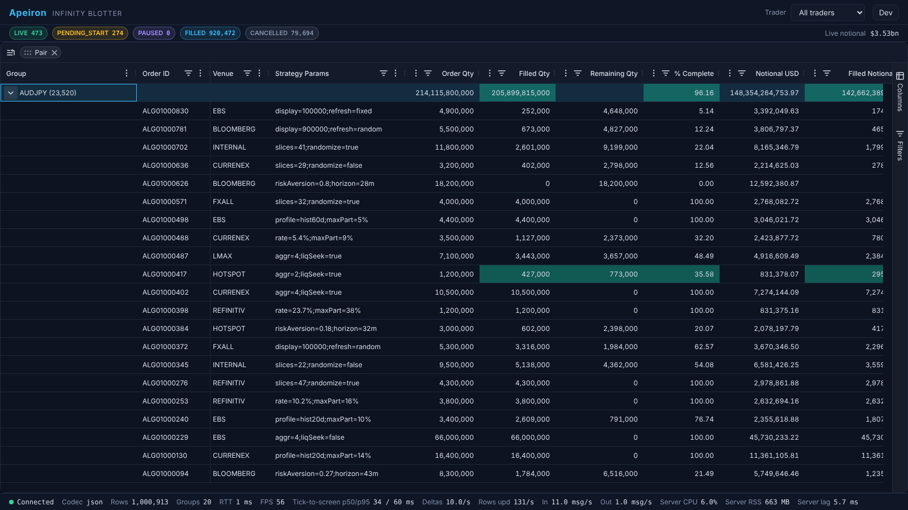
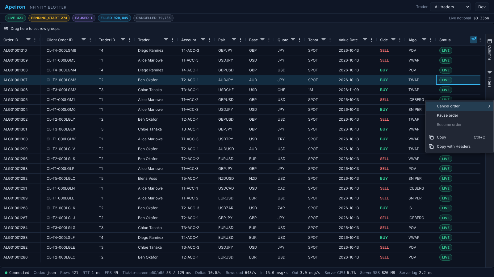
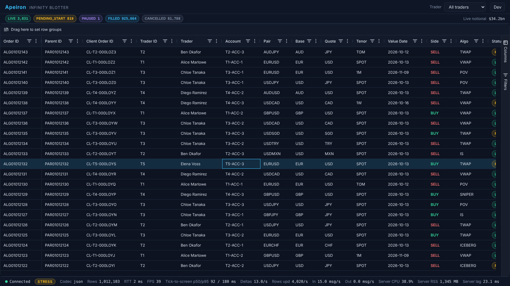

# Apeiron: User Guide

How to run the Infinity Blotter locally, use it, test it, and fix it when something goes wrong. For how it works inside,
read [`TECHNICAL-OVERVIEW.md`](TECHNICAL-OVERVIEW.md).

- [Running it](#running-it)
- [Using the blotter](#using-the-blotter)
- [Running the tests](#running-the-tests)
- [Troubleshooting](#troubleshooting)
- [Known limitations](#known-limitations)

## Running it

### Prerequisites

| Need | Version / size | Why |
|---|---|---|
| Docker with Compose v2 | Docker Desktop, or Docker Engine 29+ | every service runs in a container |
| Memory for the Docker VM | **at least 6 GB** | the server uses ~1.1 GB under load (3 GB cap), Mongo's cache is capped at 1 GB, plus NATS, nginx, Prometheus, Grafana |
| Node.js | **24** (`engines: >=24`) | the tests, the load harness and local builds |
| pnpm | 10 (`packageManager: pnpm@10.33.0`; `corepack enable` installs it) | the monorepo |
| Chromium for Playwright | `pnpm --filter @apeiron/e2e exec playwright install chromium` (once) | E2E and resilience tests |

### Clone and start

```bash
git clone https://github.com/iAppGeek/apeiron.git && cd apeiron
pnpm install

docker compose --profile core up -d --build mongo nats         # database and bus first
docker compose --profile core --profile seed run --rm gaia     # seed 1,000,000 orders (~1–3 min; a second run is a no-op)
docker compose --profile core --profile monitoring up -d --build   # server, mock middleware, web app, Prometheus, Grafana
curl -s localhost:4000/health                                  # wait for "status":"ok" (the server loads 1M rows in ~10–20 s)
```

Open <http://localhost:8080>. The server loads Mongo **once at startup**, so seed before starting it, or restart it after
seeding (`docker compose --profile core restart antikythera`).

### Seeding and reset

Test runs add orders (the table grows to ~1.3–1.5M rows after the resilience suite) and a stress run leaves thousands of
LIVE orders draining. Before a demo, a benchmark or screenshots, put the stack back to a known state:

```bash
scripts/loadtest-reset.sh
```

It stops the server, hermes and NATS, empties JetStream, re-seeds 1M rows with `SEED_RESET=true` (a fresh 6-month window
ending today), starts `core` + `monitoring` on the Medium preset and waits for `/health` (~45 s on a laptop).

Useful seed variables (in `.env`, copied from `.env.example`): `SEED_ROWS` (default 1,000,000), `SEED` (42), `SEED_NOW`
(pin the dataset's "now" for exact reproducibility), `SEED_RESET`.

### Ports

Everything binds to `127.0.0.1`.

| Service | URL / port | Profile |
|---|---|---|
| Blotter (nginx) | <http://localhost:8080> | core |
| Server: `/health`, `/metrics`, `/debug/lag`, WebSocket `/ws` | <http://localhost:4000> | core |
| MongoDB | 27017 | core, seed |
| NATS client / monitor | 4222 / <http://localhost:8222> | core |
| Prometheus | <http://localhost:9090> | monitoring |
| Grafana (anonymous view; admin / `GRAFANA_ADMIN_PASSWORD`, default `admin`) | <http://localhost:3001> | monitoring |
| Toxiproxy API / resilience web app | 8474 / <http://localhost:8081> | resilience |
| Vite dev server (`pnpm --filter @apeiron/pharos dev`) | <http://localhost:5173> | none (dev only) |

### Stopping

```bash
docker compose --profile core --profile monitoring down        # keeps the data volumes
docker compose --profile core --profile monitoring down -v     # also deletes Mongo, NATS and Prometheus data
```

## Using the blotter



### Layout

- **Header:** the *Apeiron / Infinity Blotter* brand, the **trader selector**, and the **Dev** menu.
- **Summary strip** (under the header): chips for LIVE, PENDING_START, PAUSED, FILLED and CANCELLED counts, and the live
  notional, for the selected trader (and filter).
- **Grid:** 1M+ orders × 50 columns. The **row group panel** sits above it ("Drag here to set row groups"); a side bar
  on the right has the **Columns** and **Filters** tool panels.
- **Status bar** (bottom): see [below](#status-bar).

### Traders

Pick a trader (T1–T5) or **All** from the selector. The grid, the summary chips and the row count re-scope to that trader;
a trader switch starts at the top of the grid.

### Live data

- LIVE rows tick as their pair's price moves (3 ticks/s per pair). Changed cells flash; price cells turn **green (up)** or
  **red (down)** for 600 ms.
- New orders arrive **on top** under the default sort (newest first, `createdAt` descending).
- Scrolled down, the rows you are looking at **stay put**; a **"N new orders ↑"** badge counts what arrived above.
  Click it to jump to the top (it clears); scrolling back to the top also clears it.

### Sorting

Click a column header to cycle ascending → descending → unsorted; shift-click to add more sort columns. With no sort the
grid is newest first. Sorting 1M rows takes tens of milliseconds on the server.

### Filters

Open a column's menu (☰ in the header) or the **Filters** tool panel:

| Filter | Columns | Notes |
|---|---|---|
| **Set** | enums (status, pair, side, algo type, venue, trader…) | tick values; the list comes from the server for the current trader |
| **Number** | quantities, prices, bps, P&L… | equals, not equal, <, ≤, >, ≥, **in range (inclusive)**, blank, not blank |
| **Date** | createdAt, startTime, endTime, valueDate… | whole UTC days: "equals 2026-09-15" means that whole day; in range includes both days |
| **Text** | orderId, clientOrderId, parentOrderId, strategyParams | contains, starts with, equals… (case-insensitive) |

Filters on several columns combine with AND; a column filter can hold two conditions with AND or OR. The row count in the
status bar updates at once.



### Grouping

Drag a groupable column header (pair, status, trader, account, side, algo type, venue, tenor, value date…) into the row
group panel, or use the column menu's *Group by*. Drag a second column for two levels. Group rows show the child count and
aggregates: sums for quantities, notional and P&L; notional-weighted averages for slippage, performance vs VWAP and
% complete. Expand a group to see its orders; the aggregates keep ticking. Remove a group column by dragging it out of the
panel (or its ✕).



### Order actions

Right-click an order (or press the ContextMenu key) to get **Cancel**, **Pause** and **Resume**, enabled by the order's
status:

| Status | Cancel | Pause | Resume |
|---|---|---|---|
| LIVE | ✓ | ✓ | |
| PAUSED | ✓ | | ✓ |
| PENDING_START | ✓ | | |
| FILLED, CANCELLED | | | |

Cancel asks for confirmation in a submenu. The row shows a pending marker until the server confirms; the status changes in
well under a second (click to status on screen p50 58 ms, p95 89 ms — phase 6). If the order changed state meanwhile
(another trader cancelled it), an error toast explains why. Group rows have no order actions; Copy and Copy with Headers are
always there.



### Dev menu

The **Dev** button in the header opens:

- **Wire codec:** JSON or MessagePack. Switching re-sends `hello`, reloads the grid in place (your scroll position is kept),
  and the status bar's *Codec* changes. Works both ways.
- **Load preset:** Medium (~100 updates/s, ~5 new orders/s, ~500 LIVE) or **Stress** (~2,000 updates/s, ~50 new
  orders/s, up to 5,000 LIVE). The active preset is shown, and a **STRESS** pill appears in the status bar while stress is
  on. The preset applies to the whole stack (every connected user sees it). After going back to Medium, LIVE drains back
  to ~500 over a minute or two.

### Status bar

| Item | Meaning |
|---|---|
| ● Connected / Reconnecting (#n) | the WebSocket state; the client reconnects on its own and keeps your place |
| STRESS | the stress preset is on |
| Codec | `json` or `msgpack` |
| Rows (and Groups when grouped) | total orders for the view, from the server; number of groups at the top level |
| RTT | WebSocket round trip (ping/pong) |
| FPS | the page's frame rate |
| Tick-to-screen p50/p95 | from the source event in hermes to the delta reaching this page, rolling 10 s, clock-offset corrected |
| Deltas, Rows upd | live delta messages and rows updated per second |
| In / Out | messages per second each way |
| Server CPU / RSS / lag | the server's CPU (% of one core), memory, and event-loop lag |



## Running the tests

| What | Command | Needs | Time |
|---|---|---|---|
| Lint, types, unit, property, integration | `pnpm lint && pnpm typecheck && pnpm test && pnpm build` | nothing | ~1–2 min |
| Engine benchmarks (1M rows) | `pnpm --filter @apeiron/antikythera bench` | nothing | ~30 s |
| End to end (18 Playwright tests) | `pnpm e2e` | stack on :8080 | ~2–4 min |
| Resilience, quick (standard) | `pnpm e2e:resilience:quick` | stack + `resilience` profile | ~12–14 min |
| Resilience, full (release/demo) | `pnpm e2e:resilience` | stack + `resilience` profile | ~24–28 min |
| Resilience, smoke (CI) | `pnpm e2e:resilience:smoke` | stack + `resilience` profile | ~3 min |
| Load test | `pnpm --filter @apeiron/talos start -- --clients 50 --duration 300 --codec both` | stack | 5 min |

### End to end

`pnpm e2e` runs `e2e/tests/*.e2e.ts` against <http://localhost:8080> (`E2E_BASE_URL` overrides it): grid load, sorting,
set/number/date filters, trader switching, grouping with drill-down and aggregates, live flashes, new orders on top,
anchoring and the badge (both sort paths), Cancel/Pause/Resume, codec and preset switching. It mutates a few orders;
`scripts/loadtest-reset.sh` restores the data.

### Resilience tiers

```bash
docker compose --profile core --profile resilience up -d --build   # adds toxiproxy (:8474) and pharos-e2e (:8081)
pnpm e2e:resilience:quick                                          # or :smoke, or the full pnpm e2e:resilience
pnpm --filter @apeiron/e2e exec playwright test -c playwright.resilience.config.ts s6   # one scenario
```

Each run stops the real hermes (a deterministic test driver replaces it) and starts it again at the end. Each scenario
writes `e2e/results/<scenario>-<timestamp>.json`. Run it on an otherwise idle Docker VM. If a run is killed hard:

```bash
curl -s -X POST localhost:8474/reset          # remove toxics, re-enable the proxy
docker compose --profile core start hermes
```

The scenarios (S1 steady drops, S2 flapping, S3 half-open stall, S4 outage during a burst, S5 high latency, S6 low
bandwidth, S7 server restart, S8 command across a drop) and how to read a result file are in [`TESTING.md`](TESTING.md).

### Load test and Grafana

```bash
scripts/loadtest-reset.sh                                            # always start from a known state
pnpm --filter @apeiron/talos start -- --clients 50 --duration 300 --codec both
docker compose --profile core --profile loadtest run --rm talos      # the same, from a container
```

Flags: `--clients`, `--duration` (s), `--codec json|msgpack|both`, `--no-slow`, `--no-switcher`, `--no-special`. The
default run includes a slow consumer, a codec switcher and a 60 s stress window centred in the run (120–180 s of a 300 s
run; `--stress-at`, `--stress-for`). Results go to the
console and to `loadtest/results/<timestamp>-<codec>.json` and `.md`, with a PASS/FAIL table against the targets.

Watch it live in Grafana: <http://localhost:3001>, dashboard **"Apeiron: Blotter Server"** (CPU, RSS, event-loop lag,
connections, traffic, flush and view outcomes, getRows, tick-to-client latency, backpressure, write-behind; red lines mark
the targets).

## Troubleshooting

| Symptom | Likely cause | Fix |
|---|---|---|
| Everything stalls for tens of seconds; write-behind latency climbs; `docker stats` shows memory near the VM limit | Docker VM too small or swapping (MongoDB's cache defaults to half the VM) | Give Docker ≥ 6 GB; keep `MONGO_CACHE_GB=1` (raise it only on a big host, e.g. 4 on 16 GB); stop other stacks |
| `/health` returns 503 for a while | the server is still loading the store | wait (~10–20 s for 1M rows); `docker compose logs -f antikythera` shows "store loaded" |
| Grid empty, row count 0 | the server started before seeding | seed, then `docker compose --profile core restart antikythera` |
| Row count far above 1M, many LIVE orders, sluggish start | earlier tests or stress runs grew the data or left a JetStream backlog | `scripts/loadtest-reset.sh` |
| Grid shows "Reconnecting" and never recovers | server down or restarting | `docker compose --profile core ps`; `docker compose logs antikythera`; restart it |
| No ticks, LIVE count stuck | hermes stopped (e.g. a killed resilience run) | `docker compose --profile core start hermes`; `curl -s -X POST localhost:8474/reset` if toxics remain |
| STRESS pill stays on | the preset is global | Dev → Load preset → Medium (LIVE drains over a minute or two) |
| `port is already allocated` on `compose up` | another process or stack holds 8080, 4000, 27017, 4222, 9090 or 3001 | stop it (`lsof -i :8080`), or change the host port in a local compose override |
| `pnpm` refuses to run, or engine warnings | Node older than 24 | install Node 24 and `corepack enable` |
| Playwright says the browser is missing | Chromium not installed | `pnpm --filter @apeiron/e2e exec playwright install chromium` |
| Console shows a boxed AG Grid licence message | expected: Enterprise is used without a licence key (watermark accepted) | nothing to do |

Diagnostics: `curl -s localhost:4000/health`, `curl -s localhost:4000/debug/lag` (flush, lag and write-behind figures),
`curl -s localhost:4000/metrics | grep apeiron_`, and
`pnpm --filter @apeiron/antikythera exec tsx src/testing/live-report.ts --scenario default --seconds 15`.

## Known limitations

- Under a sort other than newest-first, new rows arrive by background refresh and the view can drift about one row on the
  first refresh after scrolling.
- When 50 users open cold views at the same instant, the first views take up to ~0.3–0.45 s (they queue on one thread).
- Rare single server stalls of 200–350 ms can occur (event-loop p99 stays ~20 ms).
- After a server restart, an open order's *Last update* time can step back a few seconds for under a second, because
  price-only changes aren't stored; the next tick corrects it.
- On a severely throttled link (~16 KB/s) the page gives up and reconnects before the server does; data is correct once the
  link recovers.
- AWS hosting is designed and validated but has never been deployed ([`hosting.md`](hosting.md)).
