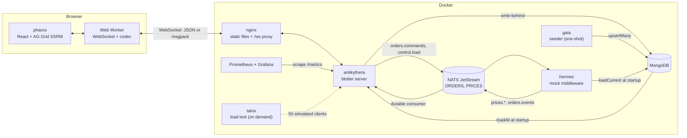
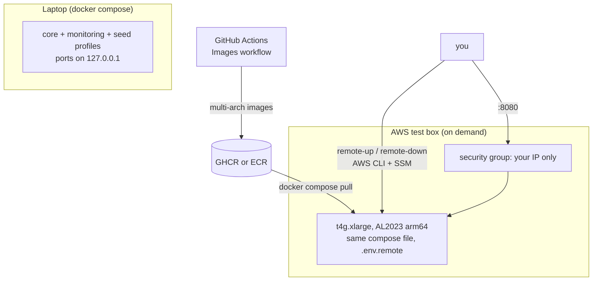

# Architecture

Apeiron shows 1M FX algo orders x 50 columns in a browser grid, ticking live, with the server doing the sorting,
filtering, grouping and aggregation for every connected blotter. This page describes the components, how data moves,
and the algorithms that make it fast. [`PLAN.md`](PLAN.md) holds the full contracts (the appendices are authoritative);
[`checkpoints/`](checkpoints) holds the measurements.

- [Components](#components)
- [Data flow](#data-flow)
- [Key algorithms](#key-algorithms)
- [Wire protocol](#wire-protocol)
- [Deployment view](#deployment-view)

## Components



| Codename | Package | Role |
|---|---|---|
| **pharos** | `apps/pharos` | The web app. React 19, AG Grid Enterprise 36 with the server-side row model, a Web Worker that owns the socket and the codec, Zustand for small app state. Served by unprivileged nginx |
| **antikythera** | `apps/antikythera` | The blotter server (Node, Fastify, `ws`). Holds every order in memory, answers `getRows`, ingests the live feed, and pushes deltas |
| **hermes** | `apps/hermes` | Mock middleware: a 20-pair random-walk price feed and the order lifecycle (pending to live, fills, new orders), and it executes commands. Stands in for the real order management system |
| **gaia** | `apps/gaia` | The seeder: deterministic generation of 1M orders over six months, bulk-loaded into the database; a second run is a no-op |
| **talos** | `apps/talos` | The load harness: N WebSocket clients, each with its own sort, filter, group and scroll pattern, reporting latency percentiles and server CPU, RSS and event-loop lag |
| **logos** | `packages/logos` | The shared vocabulary: the `Order` type, the 50-column metadata, the protocol, the JSON and msgpack codecs, the PRNG and order generator, the `Bus` port, and the order lifecycle state machine |
| **mnemosyne** | `packages/mnemosyne` | The `OrderRepository` port and its adapters (Mongo, in-memory), plus the contract suite; see [`db-adapters.md`](db-adapters.md) |
| **iris** | `packages/iris` | The NATS adapter for the `Bus` port: JetStream stream and consumer definitions |

Two ports keep the infrastructure replaceable: `OrderRepository` (storage) and `Bus` (messaging). The engine, protocol
and UI depend on neither NATS nor Mongo.

## Data flow

**Seed, load, live updates, deltas, grid.**

```mermaid
sequenceDiagram
  participant G as gaia
  participant M as MongoDB
  participant H as hermes
  participant N as NATS
  participant A as antikythera
  participant W as Worker
  participant U as AG Grid
  G->>M: upsertMany (1M orders, batches of 10,000)
  A->>M: loadAll (stream, ascending orderId)
  Note over A: columnar store filled; /health ok
  H->>M: loadCurrent (PENDING_START, LIVE, PAUSED)
  loop every 330 ms per pair
    H->>N: prices.PAIR
  end
  H->>N: orders.events (new, fills, status changes)
  N->>A: durable consumer, acked after applying
  U->>W: getRows (block, sort, filter, group)
  W->>A: getRows
  A-->>W: rows + rowCount
  W-->>U: block of 100 rows
  loop every 50 ms
    Note over A: flush: apply events to the store,<br/>patch cached views, build one delta per client
    A-->>W: delta (updates, adds, dirtyRoutes, rowCounts, newAbove)
    W-->>U: applyServerSideTransaction, flash, anchor, badge
  end
  A->>M: write-behind every 500 ms (lifecycle and fill changes)
```

1. **Seed.** `gaia` generates orders deterministically (same `SEED`, same orders) and writes them in batches.
2. **Load.** At startup `antikythera` streams `loadAll()` from the database into the columnar store (about 10 s for a
   million rows on a laptop) and then attaches to the bus. `/health` reports the row count and load time.
3. **Live updates.** `hermes` publishes price ticks (`prices.<PAIR>`, 3 per second per pair) and order events
   (`orders.events`: new orders, fills, status changes). Both streams are JetStream, and the server reads them through a
   durable consumer that acknowledges only after an event has been applied, so a restart replays what was missed.
4. **Deltas.** Every flush tick the server patches its cached views and each client session turns the changes into a
   `delta` for the rows that client holds.
5. **Grid.** The worker decodes the delta and posts it to the main thread, which applies it synchronously with
   `applyServerSideTransaction` (flash, up/down colour), keeps the viewport anchored, and counts new orders for the badge.

**Commands** go the other way: a context-menu action becomes a `command` message, the server validates it (zod, and a
state check against the lifecycle machine), publishes `orders.commands`, `hermes` applies it and publishes the resulting
order event, and the status change reaches every client as an ordinary update. The server acknowledges the command once
hermes has confirmed it, or answers `error` (shown as a toast) if the transition is not allowed.

## Key algorithms

### Columnar store

`apps/antikythera/src/store/columnar-store.ts`. Orders are not objects. Each of the 50 columns is a typed array
(`Float64Array` for numbers, timestamps and dates; `Uint16Array` or `Uint32Array` of dictionary codes for strings and
enums), with an `orderId` to row-index map for lookups, and null kept as `NaN` in numeric columns. A million orders take
about 300 to 400 MB this way, against about 1.5 GB as JavaScript objects, and filters and sorts scan contiguous memory.
Row objects are built only for the blocks being sent. Capacity is reserved up front (`STORE_CAPACITY`) so the arrays
never reallocate while serving. Enum dictionaries can grow live (a new venue); string columns keep a sort rank per
dictionary entry, refreshed in a background task rather than on the hot path. Order ids ascend, which gives radix sorts a
free tiebreak.

### Query engine

`apps/antikythera/src/query/`. Pure functions: translate the AG Grid filter model (text, number, date, set; AND/OR
conditions) into a predicate over the columns, sort a view with a multi-column radix or comparator sort into a
`Uint32Array` of row indexes, group by `rowGroupCols` and `groupKeys` with child counts, and aggregate (sum, avg, count,
and a notional-weighted average). Property tests compare every operation with a naive implementation.

### Cached views, shared between clients

A **view** is the result of one query (trader scope, filter, sort, grouping): the filtered, sorted row indexes plus lazily
built group buckets with their aggregates. Views are keyed by a hash of that query, so clients with the same view share
one result, which matters at 50 clients. The cache is LRU-evicted by size and idle time (`VIEW_CACHE_MAX_VIEWS`,
`VIEW_CACHE_MAX_MB`, 60 s idle).

### Incremental views

When an order or price changes, the store records it in a per-tick **ChangeSet** (which row, which fields, and the
previous value of the fields that matter for sorting, filtering, grouping and aggregation). Each cached view then patches
itself instead of being rebuilt:

- rows whose changed fields are not in the view's sort, filter or group columns are **value-only**: nothing moves;
- the others are **structural**: removed in one O(n) compaction pass, re-tested against the filter, re-sorted among
  themselves and merged back, with group buckets created or removed as needed;
- aggregates are adjusted by `new - previous`, and weighted averages keep the running sums;
- more than 5,000 structural rows in one tick, or a view that has fallen too far behind, rebuilds instead.

Property tests assert that a patched view equals a freshly built one, including the deferred and carried-over paths.

### Flush loop with a time budget

Every `FLUSH_MS` (50 ms) the runtime applies queued events and ticks to the store, then patches views. Patching is given
a **budget** (`FLUSH_BUDGET_MS`, 40 ms): ticks go into a shared log, and a view that cannot be patched within the budget
simply stays behind, costing nothing, and catches up on a later tick by merging the ticks it missed once, shared by every
view that missed the same ones. Views most clients are watching go first, and a view skipped for several ticks goes ahead
of them. Views no client is looking at are never patched: they are marked stale and rebuilt on their next use. A view too
far behind to patch cheaply is rebuilt between ticks, throttled. This is what turned a death spiral under stress (every
flush overrunning, growing the backlog) into a flat event-loop profile (see CP-4).

### Client tracking

For each client the server remembers which blocks it holds: `{view, blocks: LRU of routeKey#startRow -> row indexes}`,
capped at `MAX_TRACKED_BLOCKS` (the grid's `maxBlocksInCache` is set lower, so the server never under-tracks; sending a
little too much is harmless because the grid ignores rows it does not hold). Each `getRows` replaces the tracked entry for
its block. A delta contains only what a client holds:

| Change | Sent as |
|---|---|
| value-only change to a tracked row | `updates`: the changed fields plus `orderId`, per route |
| changed aggregate of a tracked group row | `groupUpdates` |
| a new order, view sorted exactly `createdAt` descending, top block tracked | `adds` with `addIndex: 0`, so it appears at the top at once |
| any other structural change touching a tracked route | `dirtyRoutes`: the client refreshes that route with `purge: false`, at most once per second |
| always | `rowCounts` per route, `newAbove`, and a status `summary` about once a second |

A slow consumer has its deltas conflated (latest value per row) and, past a limit, is disconnected with `SLOW_CONSUMER`
rather than slowing anyone else; it can reconnect.

### Anchoring: new orders on top without moving the screen

New orders arrive at the top, so a user who has scrolled down would see the rows slide away. The client prevents that:

- **Default sort (`createdAt` descending).** The delta carries an `add` at index 0. The client reads which row is at the
  top of the viewport *before* applying it, applies the transaction, then `ensureIndexVisible(top + inserted, 'top')`, and
  adds the number of rows to the "N new orders" badge. At the very top nothing scrolls and there is no badge. Clicking the
  badge scrolls to the top and clears it.
- **Any other sort (the refresh path).** Rows cannot be placed precisely, so the server marks the root route dirty and the
  client refreshes it in the background. Just before the refresh starts the client notes the order at the top of the
  viewport; when AG Grid reports `storeRefreshed` it looks up where that order is now and scrolls to it. (The server's
  `newAbove` is not enough here: a refresh ends by re-requesting block 0, so the server's idea of "the client's top row"
  is row 0 and it undercounts.) A move far larger than the number of rows that arrived, such as a sort on a ticking
  column reordering itself, is ignored.
- The scroll position cannot be trusted past about a million rows (AG Grid scales the scroll height), so the top row is
  read from the rendered rows rather than computed from pixels.

### The client: worker, codecs, applying deltas

The socket and the decoder (JSON, or msgpack negotiated in `hello`) live in a Web Worker so parsing never blocks
rendering. Above 20 deltas per second the worker coalesces them once per animation frame (adds before updates, latest value
per row and field, `newAbove` summed). The main thread applies each delta with the **synchronous**
`applyServerSideTransaction`, merging every partial row into the row's current data right before the call: the async API
would merge two partials against stale data and lose fields. Price cells flash and are coloured up or down for 600 ms.

### Write-behind

The server persists lifecycle and fill changes (not price-only changes) in batches every 500 ms with `upsertMany`, so a
restart (and `hermes`, which rebuilds from `loadCurrent()`) sees the current state. The in-memory store is the source of
truth while running.

## Wire protocol

Authoritative: `docs/PLAN.md` Appendix C and `packages/logos/src/protocol.ts`.

| Direction | Messages |
|---|---|
| client to server | `hello` (trader, codec), `getRows`, `setFilterValues`, `command`, `control` (load preset), `ping` |
| server to client | `welcome`, `rows`, `filterValues`, `delta`, `summary`, `ack`, `error`, `pong` |

## Deployment view



See [`hosting.md`](hosting.md) for the details, costs and security notes.
