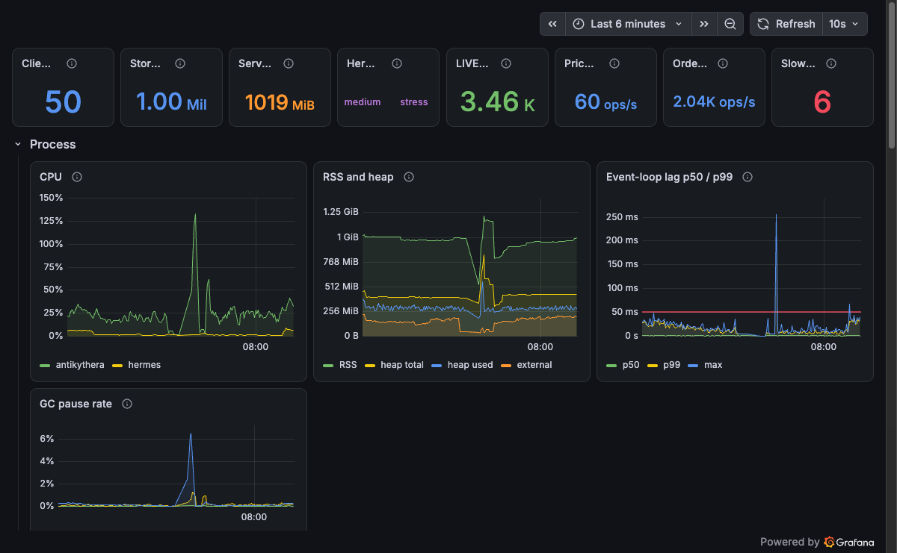

# CP-4: Observability, load test and performance verdict

Branch `phase-7-observability`. This checkpoint covers phases 6 and 7. It also records an incident: the first load run took the server down, and the investigation (and a second, environmental cause) changed antikythera and the compose file.

**Review update (APPROVE WITH FIXES applied, section 12):** the flush interval is now 50 ms, `delta.srcTs` makes tick-to-screen a true end-to-end figure (p95 62 to 65 ms in the final runs), and sections 5 to 9 below are the pre-review runs at `FLUSH_MS=100`, kept as the record of the incident fix.

**Verdict in one line (before the review fixes):** with the fixes below, 50 clients for 300 s meet every POC target with both codecs, and a 600 s soak with 240 s of stress runs without a stall. The first full run did not.

## 1. What was built

| Part | Where | Notes |
|---|---|---|
| antikythera `GET /metrics` | `apps/antikythera/src/metrics.ts` | `prom-client` 15.1.3 (latest). Hot-path counters and histograms updated inline; store, cache, client and lag gauges read at scrape time. |
| hermes metrics | `apps/hermes/src/metrics.ts`, `health.ts` | On the health port, `:4100/metrics`. |
| Prometheus + Grafana | `infra/prometheus`, `infra/grafana`, compose `monitoring` profile | `prom/prometheus:v3.15.0`, `grafana/grafana:13.2`, ports on 127.0.0.1 (9090, 3001). Scrape every 2 s. Dashboard "Apeiron: Blotter Server", 41 panels, red lines at the POC targets. Anonymous Viewer access (local only; documented in README and compose). |
| `apps/talos` | `apps/talos` | Load-test CLI. 15 spec files, 116 tests. Deterministic per seed. Open-loop scheduler: latency is measured from the intended send time. Slow consumer, codec switcher and stress-window controller. Scrapes `/metrics` every 2 s. Console table, `loadtest/results/<timestamp>-<codec>.json` and `.md`. Compose service `talos` in the `loadtest` profile. |
| Flush-loop rework (R1, R2, R3, R5) | `apps/antikythera/src/query/engine.ts`, `view.ts`, `live/runtime.ts`, `live/write-behind.ts`, `packages/iris` | See section 4. |
| `scripts/loadtest-reset.sh` | `scripts/` | Puts the stack in a known state before a run (re-seed, empty JetStream). |

Phase 6 (actions) was already merged; the measurements here include its command path (about 2.7 commands/s across 50 clients, ack p95 about 115 ms).

## 2. Metrics catalogue

antikythera (`:4000/metrics`). Label values are fixed small sets; nothing is labelled by client or order id.

| Metric | Type | Labels | Meaning |
|---|---|---|---|
| `process_*`, `nodejs_*` (default metrics) | various | | CPU, RSS, heap, GC, event-loop lag (prom-client defaults) |
| `apeiron_process_cpu_percent` | gauge | | CPU over the last second, % of one core |
| `apeiron_event_loop_lag_seconds` | gauge | `quantile`: 0.5, 0.99, max | Lag above the 10 ms sampling resolution over the last 1 s window |
| `apeiron_ws_connections` | gauge | | Open sockets, including ones that have not said hello |
| `apeiron_ws_clients` | gauge | `codec` | Clients that said hello |
| `apeiron_ws_messages_total`, `apeiron_ws_bytes_total` | counter | `direction`, `type`, `codec` | Messages and payload bytes by protocol message type |
| `apeiron_flush_duration_seconds` | histogram | | One flush tick |
| `apeiron_getrows_duration_seconds` | histogram | `temp` (cold, warm), `shape` (flat, grouped) | Server-side getRows time |
| `apeiron_delta_bytes` | histogram | | Encoded size of each delta |
| `apeiron_event_age_at_flush_seconds` | histogram | | Age of the oldest queued event or tick when its flush ran |
| `apeiron_ingest_events_total` | counter | `type` (price, order, command) | Events ingested |
| `apeiron_ingest_queue_depth`, `apeiron_live_rows` | gauge | | Queued order events; LIVE/PAUSED rows repriced |
| `apeiron_write_behind_batch_size`, `_duration_seconds`, `_failures_total`, `_queue_depth` | histogram, counter, gauge | | Write-behind batches |
| `apeiron_view_cache_views`, `_bytes`, `_hits_total`, `_misses_total`, `_evictions_total` | gauge, counter | | View cache |
| `apeiron_flush_views_total` | counter | `outcome`: patched, deferred, unsubscribed, pending_rebuild | What each flush did with the cached views (new in the rework) |
| `apeiron_views_stale`, `apeiron_views_rebuild_pending`, `apeiron_view_rebuild_duration_seconds` | gauge, histogram | | Stale views, views waiting for a deferred rebuild, rebuild time (new) |
| `apeiron_backpressure_events_total` | counter | `event`: soft_conflate, slow_consumer | Client send-queue events |
| `apeiron_command_duration_seconds` | histogram | `outcome` (ok or an error code) | Command round trip |
| `apeiron_errors_total` | counter | `code` | Error messages sent |
| `apeiron_commands_pending` | gauge | | Commands waiting for hermes |
| `apeiron_store_rows`, `apeiron_store_loaded` | gauge | | Store size, loaded flag |

hermes (`:4100/metrics`): `hermes_events_published_total{type}`, `hermes_price_ticks_total`, `hermes_commands_handled_total`, `hermes_publish_errors_total`, `hermes_live_orders`, `hermes_pending_orders`, `hermes_publish_inflight`, `hermes_preset{preset}` (one-hot gauge), plus default process metrics.

## 3. How the load test is run, and what it measures

- **Clients (seeded):** each picks a trader (ALL or T1 to T5), a flat or grouped view (40% grouped, 1 or 2 levels), a sort and a filter (set, number, date or text; numeric and date thresholds are continuous so most filters make a view nobody has built). Scrolls 2 blocks/s with jitter (25% of requests the top block, group drill-downs use keys the client was actually sent), changes sort, filter or grouping about every 45 s, sends a Pause or Resume on a LIVE order it has seen about every 10 s.
- **Special clients:** client 1 is the slow consumer (stops reading at 20% of the run and keeps requesting 2,000-row blocks until the server closes it, then reads the `SLOW_CONSUMER` error and reconnects); client 2 is the codec switcher (re-sends `hello` with the other codec every 20 s and checks `getRows` and the frame type); client 0 also switches hermes to `stress` for 60 s in the middle of the run and back.
- **Coordinated omission:** each stream has a fixed timeline; a slot already past due goes out at once; latency = response time minus intended time. The report includes the generator's own send lag and event-loop lag (p99 2 ms, max under 21 ms in every run below), so a slow generator cannot be mistaken for a slow server.
- **"cold" in the table** is the first getRows after the client changed its view. The server's own cold/warm split is in the histogram section of each report.
- **Clock offset** for delta latency comes from `ping`/`pong` (lowest round trip of the last 8). Client and server share a host clock here, so the offset is about 0.
- **Between runs:** `scripts/loadtest-reset.sh` (see section 5 for why this matters).

## 4. The incident, the diagnosis and the fixes

### 4.1 First run (before any fix): the server stopped responding

Raw console output of the first 50 client, 300 s, json run (commit `c4845aa`):

```
talos: 50 clients, 300s, codec json, seed 1, 2026-10-07T06:10:51.219Z

Latency, json (50 clients), ms
                                p50      p95      p99      max      n
getRows warm                 1625.0  15002.4  15003.0  15007.3  29054
getRows cold (view change)    334.0  15002.3  15003.1  15005.0    383
delta (serverTs to receipt)     6.0     73.0    173.0  12940.0  34322
command ack                    72.6    428.5   1738.6   2926.4    408

Delta latency by phase, json, ms
           p50    p95     p99      max      n
baseline   5.0   25.0    89.0    352.0  30650
stress    56.0  292.5  2490.0  12940.0   3672
after        -      -       -        -      0

Traffic per client, json
     msgs/s  KB/s
in      4.1  77.9
out     2.2   0.6
errors by code: {"INVALID_TRANSITION":111,"SLOW_CONSUMER":1,"UNKNOWN_ORDER":1,"INTERNAL":86,"TIMEOUT":13272}

Server (/metrics every 2s, 71 scrapes, 28 failed)
                                     min  median     max
CPU % of one core                   10.8    25.8   106.7
RSS MB                               875    1126    1171
heap used MB                         306     339     379
event-loop lag p99 ms (1s windows)   0.0    11.5  2179.4
event-loop lag max ms (1s windows)   0.0    19.6  2179.4

Server-side histograms over the run
                                              value
getRows warm p95 ms                            1.97
getRows cold p95 ms                           47.28
getRows cold / warm count               203 / 14375
flush p50 / p99 ms                    4.30 / 192.10
event age at flush p95 ms                     228.3
delta size p95 bytes                          28894
command p95 ms                                283.0
soft_conflate / slow_consumer events         29 / 1

Targets
                                            target      measured  verdict
getRows p95 (warm, client-measured)        < 50 ms  json 15002.4     FAIL
View change: cold getRows p95             < 300 ms  json 15002.3     FAIL
Delta latency p95 (serverTs to receipt)   < 150 ms     json 73.0     PASS
Event-loop lag p99 (server, whole run)     < 50 ms    all 2179.4     FAIL
Server RSS max                           < 2048 MB    all 1170.5     PASS

Events (seconds into the run)
      0.0s  preset.seen {"preset":"medium"}
     20.0s  codec.switch {"to":"msgpack","welcomed":true,"getRowsOk":true,"frameTypeOk":true,"ms":3,"code":null}
     40.0s  codec.switch {"to":"json","welcomed":true,"getRowsOk":true,"frameTypeOk":true,"ms":1,"code":null}
     60.0s  slow.paused 
     60.0s  codec.switch {"to":"msgpack","welcomed":true,"getRowsOk":true,"frameTypeOk":true,"ms":40,"code":null}
     62.3s  server.soft_conflate_first_seen {"note":"first /metrics scrape after the pause that shows deltas being held back"}
     64.3s  server.slow_consumer_first_seen {"note":"first /metrics scrape that shows the client closed with SLOW_CONSUMER"}
     65.0s  slow.server_closed_seen {"serverClosedIt":true,"fills":5}
     65.0s  slow.resumed {"pausedMs":5002}
     65.0s  slow.error_received 
     65.5s  slow.after_resume {"slowConsumerError":true,"closed":true,"closeCode":1013}
     65.5s  slow.reconnect {"ok":true,"ms":6}
     80.5s  codec.switch {"to":"json","welcomed":true,"getRowsOk":true,"frameTypeOk":true,"ms":378,"code":null}
    100.4s  codec.switch {"to":"msgpack","welcomed":true,"getRowsOk":true,"frameTypeOk":true,"ms":358,"code":null}
    120.0s  stress.stress {"acked":true,"ackMs":189}
    121.9s  codec.switch {"to":"json","welcomed":true,"getRowsOk":true,"frameTypeOk":true,"ms":1654,"code":null}
    122.7s  preset.seen {"preset":"stress"}
    140.1s  codec.switch {"to":"msgpack","welcomed":true,"getRowsOk":true,"frameTypeOk":true,"ms":35,"code":null}
    180.0s  stress.medium {"acked":false,"ackMs":15000}
    185.0s  codec.switch {"to":"json","welcomed":false,"getRowsOk":false,"frameTypeOk":false,"ms":15000,"code":"TIMEOUT"}
    210.0s  codec.switch {"to":"msgpack","welcomed":false,"getRowsOk":false,"frameTypeOk":false,"ms":15001,"code":"TIMEOUT"}
    235.0s  codec.switch {"to":"json","welcomed":false,"getRowsOk":false,"frameTypeOk":false,"ms":15002,"code":"TIMEOUT"}
    260.0s  codec.switch {"to":"msgpack","welcomed":false,"getRowsOk":false,"frameTypeOk":false,"ms":15000,"code":"TIMEOUT"}
    285.0s  codec.switch {"to":"json","welcomed":false,"getRowsOk":false,"frameTypeOk":false,"ms":15000,"code":"TIMEOUT"}
    310.0s  codec.switch {"to":"msgpack","welcomed":false,"getRowsOk":false,"frameTypeOk":false,"ms":15001,"code":"TIMEOUT"}
    335.0s  codec.switch {"to":"json","welcomed":false,"getRowsOk":false,"frameTypeOk":false,"ms":15000,"code":"TIMEOUT"}

generator: send lag p99 2.0 ms, max 7.3 ms; own event-loop lag p99 2.4 ms, max 7.3 ms; counters {"scrolls":29353,"viewChanges":331,"commandsSent":1212,"commandsSkipped":251,"unexpectedCloses":0,"connectFailures":0}
```

The stress window started at 120 s. By about 140 s event-loop stalls of 2.7 s and then 13 s began, and from 180 s every request timed out (15 s client timeout) for the rest of the run. The server recovered only after the clients went away.

### 4.2 Root cause 1: a death spiral in the flush loop (Opus diagnosis, `CP-4-diagnosis.md`)

Views no client used were still patched every tick; a tick with more than 5,000 structural changes rebuilt every affected view synchronously inside the flush; a slow tick made the next tick's ChangeSet larger, so it rebuilt again. Fixed in antikythera:

- **R1** A view with no subscribers is not patched; it drops its derived state (`stale`) and is rebuilt, as a cold request, when it is next asked for. The 60 s idle eviction stays.
- **R2** A view over the structural threshold is marked `rebuildPending` instead of being rebuilt in the flush. It is rebuilt after the tick's deltas have been sent, at most once a second per view and one per event-loop turn (`setImmediate`), and its subscribers then get `dirtyRoutes` for every route they track.
- **R3** The flush patches views within a time budget (`FLUSH_BUDGET_MS`, default 40), most-watched views first (a view skipped for 3 ticks goes first). Ticks are kept in a shared log; a view that missed ticks has them merged once when it is next patched, and views that missed the same ticks share the merge. A view too far behind for a patch to pay (merged rows over 4 times the threshold) becomes a pending rebuild. The first implementation copied each tick into every deferred view; the profile of a second stall showed that copying was itself the next death spiral, so it was replaced by the shared log.
- **R4 (comparator) not taken.** After the rework `rank` is 9.8% of busy CPU in the stress window (about 2% of a core), which does not justify a second code path.
- **R5** `ack_wait` 30 s to 60 s (`max_ack_pending` stays 20,000); consumer pulls bounded to 500 messages; write-behind writes in chunks of 1,000 orders with a yield between chunks and acknowledges only after the last. The NATS `TimeoutError`s in the failing run were JetStream **publishes of commands** (`NatsBus.publish` from `LiveRuntime.command`) whose replies were processed late because the loop was stalled; they were a symptom, not a hot-path request, and need no code change.
- Tests: units for each of R1 to R3 (`query/engine.deferred.spec.ts`, `live/runtime.spec.ts`, `live/tracker.spec.ts`, `query/changeset.spec.ts`), and the incremental-vs-rebuild **property test** now also covers carried-over ticks (budget 0 and partial budgets), deferred rebuilds, carry together with deferred rebuilds, and views that nobody tracks (all, half, none). Every covered path must equal a fresh build after each compared tick.

### 4.3 Root cause 2: the Docker VM ran out of memory (found while verifying the fix)

With the flush fixed, the 300 s runs passed but the 600 s soak (50 clients, both codecs, 240 s of stress) stalled twice more: server stalls of 84 s and 182 s, with the CPU profile showing nothing but ordinary request handling. The first sign was write-behind latency going from 90 ms to 8 s; `/proc/pressure/memory` inside the VM showed **memory stalls 60 to 76% of the time**, swap full (1,024 of 1,024 MB), with a 5.9 GB VM shared with other containers on this laptop. MongoDB's default WiredTiger cache is half the VM's RAM, so sustained write-behind pushed the VM into swap and every container, including antikythera, stalled together. This is also why single runs were not repeatable until the Mongo cache was capped.

Fix: `mongo` now starts with `--wiredTigerCacheSizeGB 1` (the dataset's working set fits). After that the soak ran cleanly.

Isolation runs on the way (360 s, stress from 40 s for 240 s, both codecs): no specials; switcher and controller only; slow consumer and controller only. None stalled, which is why the memory pressure, not the special clients, is the cause.

### 4.4 Before and after

| 50 clients, 300 s, json | Before (c4845aa) | After (final) | Target |
|---|---|---|---|
| getRows warm p95 (client) | 15,002 ms (timeouts) | 17.4 ms | < 50 ms |
| View-change (cold) getRows p95 | 15,002 ms | 110 ms | < 300 ms |
| Delta latency p95 | 73 ms (p99 173, max 12,940) | 21 ms (p99 27, max 124) | < 150 ms |
| Event-loop lag p99 | 2,179 ms (worst 1 s window) | 17.8 ms (whole run) | < 50 ms |
| Server RSS max | 1,171 MB | 1,035 MB | < 2,048 MB |
| Requests timed out | 13,272 | 0 | |
| Flush p99 (server histogram) | 192 ms | 44 ms | |

CPU profile of the stress window, container, 50 clients, 30 s of stress (node `--cpu-prof`, busy time only): busy 6.4 s of 30 s (21% of a core; the pre-fix profile in the diagnosis was 29%).

```
total 30.0s busy 6.4s
-- self
  9.8% rank sort.js:231
  9.3% encode codec.js:6
  8.9% (garbage collector) :0
  5.9% patch view.js:324
  4.2% writev :0
  3.5% onFlush session.js:66
  3.5% rowAt columnar-store.js:262
  3.1% (program) :0
  2.7% applyLeaf view.js:379
  2.6% radixSort sort.js:88
  2.4% applyGroup view.js:439
  2.1% insertAt row-buf.js:63
  1.7% (anon) filter.js:167
  1.5% note tracker.js:204
-- inclusive
100.0% (root) :0
```

### 4.5 What stalled runs looked like (kept for the record)

| Run | Outcome |
|---|---|
| 300 s json, before the fix | stalled from about 140 s, see 4.1 |
| 300 s json, first attempt after R1 to R3 (per-view carry copies) | stalled from about 22 s; event-loop lag max 220 s; the server had also been restarted on top of the previous stalled run's JetStream backlog and extra LIVE rows (probably a contributing cause; the run was not repeated as-is) |
| 600 s soak, per-view carry copies, Mongo cache uncapped (twice) | stalled for 84 s and 182 s from about 215 s |
| 600 s soak, shared tick log, Mongo cache uncapped | healthy through the stress window, stalled after it from about 360 s (VM swap) |
| 600 s soak, shared tick log, Mongo cache capped | passed (section 5.3) |

## 5. Load-test results (final code)

Targets: getRows p95 < 50 ms, view change (cold getRows) < 300 ms, delta p95 < 150 ms, event-loop lag p99 < 50 ms, RSS < 2 GB.

### 5.1 50 clients, 300 s, json (pre-review, `FLUSH_MS=100`; host talos process, specials, stress 120 to 180 s)

```
talos: 50 clients, 300s, codec json, seed 1, 2026-10-07T10:00:41.136Z

Latency, json (50 clients), ms
                              p50    p95    p99    max      n
getRows warm                  5.0   17.4   27.0  112.7  29073
getRows cold (view change)   18.6  110.0  220.0  301.0    382
delta (serverTs to receipt)   5.0   21.0   27.0  124.0  81885
command ack                  66.7  113.9  131.2  152.2    825

Delta latency by phase, json, ms
          p50   p95   p99    max      n
baseline  5.5  20.0  26.0  124.0  30701
stress    6.0  25.0  30.0   76.5  21360
after     2.0  17.0  21.0   28.0  29824

Traffic per client, json
     msgs/s   KB/s
in      8.7  151.3
out     2.2    0.7
errors by code: {"INVALID_TRANSITION":370,"SLOW_CONSUMER":1}

Server (/metrics every 2s, 151 scrapes, 0 failed)
                                    min  median    max
CPU % of one core                   7.9    21.1  121.3
RSS MB                              637     986   1035
heap used MB                        245     292    337
event-loop lag p99 ms (1s windows)  3.1    11.2   41.2
event-loop lag max ms (1s windows)  3.7    16.4   53.3
event-loop lag over the whole run (server histogram): p50 0.9 ms, p99 17.8 ms, max 208.8 ms

Server-side histograms over the run
                                             value
getRows warm p95 ms                           0.90
getRows cold p95 ms                          30.36
getRows cold / warm count              377 / 29378
flush p50 / p99 ms                    3.21 / 44.39
event age at flush p95 ms                    150.6
delta size p95 bytes                         37877
command p95 ms                               173.1
soft_conflate / slow_consumer events        30 / 1

Targets
                                            target    measured  verdict
getRows p95 (warm, client-measured)        < 50 ms   json 17.4     PASS
View change: cold getRows p95             < 300 ms  json 110.0     PASS
Delta latency p95 (serverTs to receipt)   < 150 ms   json 21.0     PASS
Event-loop lag p99 (server, whole run)     < 50 ms    all 17.8     PASS
Server RSS max                           < 2048 MB  all 1034.8     PASS

Events (seconds into the run)
      0.0s  preset.seen {"preset":"medium"}
     20.0s  codec.switch {"to":"msgpack","welcomed":true,"getRowsOk":true,"frameTypeOk":true,"ms":17,"code":null}
     40.0s  codec.switch {"to":"json","welcomed":true,"getRowsOk":true,"frameTypeOk":true,"ms":0,"code":null}
     60.0s  slow.paused 
     60.1s  codec.switch {"to":"msgpack","welcomed":true,"getRowsOk":true,"frameTypeOk":true,"ms":3,"code":null}
     62.3s  server.soft_conflate_first_seen {"note":"first /metrics scrape after the pause that shows deltas being held back"}
     68.3s  server.slow_consumer_first_seen {"note":"first /metrics scrape that shows the client closed with SLOW_CONSUMER"}
     69.0s  slow.server_closed_seen {"serverClosedIt":true,"fills":9}
     69.0s  slow.resumed {"pausedMs":9015}
     69.1s  slow.error_received 
     69.5s  slow.after_resume {"slowConsumerError":true,"closed":true,"closeCode":1013}
     69.5s  slow.reconnect {"ok":true,"ms":6}
     80.0s  codec.switch {"to":"json","welcomed":true,"getRowsOk":true,"frameTypeOk":true,"ms":2,"code":null}
    100.0s  codec.switch {"to":"msgpack","welcomed":true,"getRowsOk":true,"frameTypeOk":true,"ms":2,"code":null}
    120.0s  stress.stress {"acked":true,"ackMs":3}
    120.0s  codec.switch {"to":"json","welcomed":true,"getRowsOk":true,"frameTypeOk":true,"ms":19,"code":null}
    120.5s  preset.seen {"preset":"stress"}
    140.0s  codec.switch {"to":"msgpack","welcomed":true,"getRowsOk":true,"frameTypeOk":true,"ms":0,"code":null}
    160.0s  codec.switch {"to":"json","welcomed":true,"getRowsOk":true,"frameTypeOk":true,"ms":14,"code":null}
    180.0s  stress.medium {"acked":true,"ackMs":8}
    180.0s  codec.switch {"to":"msgpack","welcomed":true,"getRowsOk":true,"frameTypeOk":true,"ms":0,"code":null}
    180.1s  preset.seen {"preset":"medium"}
    200.0s  codec.switch {"to":"json","welcomed":true,"getRowsOk":true,"frameTypeOk":true,"ms":1,"code":null}
    220.0s  codec.switch {"to":"msgpack","welcomed":true,"getRowsOk":true,"frameTypeOk":true,"ms":0,"code":null}
    240.0s  codec.switch {"to":"json","welcomed":true,"getRowsOk":true,"frameTypeOk":true,"ms":11,"code":null}
    260.0s  codec.switch {"to":"msgpack","welcomed":true,"getRowsOk":true,"frameTypeOk":true,"ms":13,"code":null}
    280.0s  codec.switch {"to":"json","welcomed":true,"getRowsOk":true,"frameTypeOk":true,"ms":2,"code":null}

generator: send lag p99 2.0 ms, max 10.1 ms; own event-loop lag p99 2.5 ms, max 7.0 ms; counters {"scrolls":29353,"viewChanges":329,"commandsSent":1207,"commandsSkipped":261,"unexpectedCloses":0,"connectFailures":0}
```

### 5.2 50 clients, 300 s, msgpack

```
talos: 50 clients, 300s, codec msgpack, seed 1, 2026-10-07T10:06:48.483Z

Latency, msgpack (50 clients), ms
                              p50    p95    p99    max      n
getRows warm                  5.3   18.3   29.2  332.7  29065
getRows cold (view change)   18.9  118.0  335.0  370.0    379
delta (serverTs to receipt)   5.5   25.0   35.0  187.0  86160
command ack                  63.9  115.3  131.7  183.1    826

Delta latency by phase, msgpack, ms
          p50   p95   p99    max      n
baseline  3.0  11.5  38.0  187.0  31088
stress    8.0  32.0  39.0   86.0  21590
after     3.0  18.5  22.5   28.0  33482

Traffic per client, msgpack
     msgs/s   KB/s
in      9.0  129.7
out     2.2    0.5
errors by code: {"INVALID_TRANSITION":371,"SLOW_CONSUMER":1,"UNKNOWN_ORDER":1}

Server (/metrics every 2s, 151 scrapes, 0 failed)
                                    min  median    max
CPU % of one core                   7.8    23.9  144.0
RSS MB                              704    1025   1094
heap used MB                        245     289    339
event-loop lag p99 ms (1s windows)  4.1    11.7   35.6
event-loop lag max ms (1s windows)  4.8    18.0   54.6
event-loop lag over the whole run (server histogram): p50 1.0 ms, p99 19.2 ms, max 363.6 ms

Server-side histograms over the run
                                             value
getRows warm p95 ms                           0.89
getRows cold p95 ms                          34.74
getRows cold / warm count              374 / 29376
flush p50 / p99 ms                    3.56 / 45.72
event age at flush p95 ms                    193.2
delta size p95 bytes                         32291
command p95 ms                               161.0
soft_conflate / slow_consumer events        46 / 1

Targets
                                            target       measured  verdict
getRows p95 (warm, client-measured)        < 50 ms   msgpack 18.3     PASS
View change: cold getRows p95             < 300 ms  msgpack 118.0     PASS
Delta latency p95 (serverTs to receipt)   < 150 ms   msgpack 25.0     PASS
Event-loop lag p99 (server, whole run)     < 50 ms       all 19.2     PASS
Server RSS max                           < 2048 MB     all 1094.3     PASS

Events (seconds into the run)
      0.0s  preset.seen {"preset":"medium"}
     20.0s  codec.switch {"to":"json","welcomed":true,"getRowsOk":true,"frameTypeOk":true,"ms":7,"code":null}
     40.0s  codec.switch {"to":"msgpack","welcomed":true,"getRowsOk":true,"frameTypeOk":true,"ms":23,"code":null}
     60.0s  slow.paused 
     60.1s  codec.switch {"to":"json","welcomed":true,"getRowsOk":true,"frameTypeOk":true,"ms":4,"code":null}
     60.3s  server.soft_conflate_first_seen {"note":"first /metrics scrape after the pause that shows deltas being held back"}
     74.3s  server.slow_consumer_first_seen {"note":"first /metrics scrape that shows the client closed with SLOW_CONSUMER"}
     75.0s  slow.server_closed_seen {"serverClosedIt":true,"fills":15}
     75.0s  slow.resumed {"pausedMs":15009}
     75.2s  slow.error_received 
     75.5s  slow.after_resume {"slowConsumerError":true,"closed":true,"closeCode":1013}
     75.5s  slow.reconnect {"ok":true,"ms":8}
     80.0s  codec.switch {"to":"msgpack","welcomed":true,"getRowsOk":true,"frameTypeOk":true,"ms":2,"code":null}
    100.0s  codec.switch {"to":"json","welcomed":true,"getRowsOk":true,"frameTypeOk":true,"ms":2,"code":null}
    120.0s  stress.stress {"acked":true,"ackMs":3}
    120.0s  codec.switch {"to":"msgpack","welcomed":true,"getRowsOk":true,"frameTypeOk":true,"ms":1,"code":null}
    120.1s  preset.seen {"preset":"stress"}
    140.0s  codec.switch {"to":"json","welcomed":true,"getRowsOk":true,"frameTypeOk":true,"ms":10,"code":null}
    160.0s  codec.switch {"to":"msgpack","welcomed":true,"getRowsOk":true,"frameTypeOk":true,"ms":1,"code":null}
    180.0s  stress.medium {"acked":true,"ackMs":16}
    180.0s  codec.switch {"to":"json","welcomed":true,"getRowsOk":true,"frameTypeOk":true,"ms":1,"code":null}
    180.0s  preset.seen {"preset":"medium"}
    200.0s  codec.switch {"to":"msgpack","welcomed":true,"getRowsOk":true,"frameTypeOk":true,"ms":0,"code":null}
    220.0s  codec.switch {"to":"json","welcomed":true,"getRowsOk":true,"frameTypeOk":true,"ms":1,"code":null}
    240.0s  codec.switch {"to":"msgpack","welcomed":true,"getRowsOk":true,"frameTypeOk":true,"ms":1,"code":null}
    260.0s  codec.switch {"to":"json","welcomed":true,"getRowsOk":true,"frameTypeOk":true,"ms":2,"code":null}
    280.0s  codec.switch {"to":"msgpack","welcomed":true,"getRowsOk":true,"frameTypeOk":true,"ms":18,"code":null}

generator: send lag p99 2.0 ms, max 11.8 ms; own event-loop lag p99 2.5 ms, max 11.6 ms; counters {"scrolls":29345,"viewChanges":326,"commandsSent":1210,"commandsSkipped":259,"unexpectedCloses":0,"connectFailures":0}
```

### 5.3 Soak: 50 clients, 600 s, both codecs (25 each), specials, stress 180 to 420 s

```
talos: 50 clients, 600s, codec both, seed 1, 2026-10-07T09:49:34.084Z

Latency, json (25 clients), ms
                              p50    p95    p99    max      n
getRows warm                  5.2   18.7   32.0  327.1  29377
getRows cold (view change)   17.3   58.0  258.0  269.0    363
delta (serverTs to receipt)   6.0   29.5   38.0  153.5  95757
command ack                  67.2  115.8  135.2  175.1    702

Delta latency by phase, json, ms
          p50   p95   p99    max      n
baseline  3.0  11.0  15.0  153.5  26822
stress    7.0  32.0  39.0   54.0  46004
after     3.0  31.0  38.0   46.0  22931

Traffic per client, json
     msgs/s   KB/s
in      9.6  159.9
out     2.3    0.7
errors by code: {"INVALID_TRANSITION":657}

Latency, msgpack (25 clients), ms
                              p50    p95    p99    max      n
getRows warm                  5.6   19.3   32.9  268.3  29376
getRows cold (view change)   17.8   56.0  223.0  246.0    369
delta (serverTs to receipt)   6.5   30.0   38.0  233.5  89227
command ack                  66.6  116.3  134.9  152.9    624

Delta latency by phase, msgpack, ms
          p50   p95    p99    max      n
baseline  3.0  11.5  128.5  233.5  19570
stress    7.0  31.0   38.0   56.0  45315
after     3.0  32.0   38.0   45.5  24342

Traffic per client, msgpack
     msgs/s   KB/s
in      9.3  144.2
out     2.3    0.5
errors by code: {"INVALID_TRANSITION":684,"SLOW_CONSUMER":1}

Server (/metrics every 2s, 300 scrapes, 0 failed)
                                     min  median    max
CPU % of one core                   10.2    23.4  118.1
RSS MB                               730    1035   1114
heap used MB                         248     293    377
event-loop lag p99 ms (1s windows)   4.0    16.4   43.2
event-loop lag max ms (1s windows)   4.5    22.0   56.6
event-loop lag over the whole run (server histogram): p50 0.9 ms, p99 26.1 ms, max 246.1 ms

Server-side histograms over the run
                                             value
getRows warm p95 ms                           0.83
getRows cold p95 ms                          30.26
getRows cold / warm count              699 / 58797
flush p50 / p99 ms                    6.14 / 47.82
event age at flush p95 ms                    212.9
delta size p95 bytes                         58177
command p95 ms                               178.5
soft_conflate / slow_consumer events        42 / 1

Targets
                                            target                 measured  verdict
getRows p95 (warm, client-measured)        < 50 ms  json 18.7, msgpack 19.3     PASS
View change: cold getRows p95             < 300 ms  json 58.0, msgpack 56.0     PASS
Delta latency p95 (serverTs to receipt)   < 150 ms  json 29.5, msgpack 30.0     PASS
Event-loop lag p99 (server, whole run)     < 50 ms                 all 26.1     PASS
Server RSS max                           < 2048 MB               all 1114.3     PASS

Events (seconds into the run)
      0.0s  preset.seen {"preset":"medium"}
     20.0s  codec.switch {"to":"msgpack","welcomed":true,"getRowsOk":true,"frameTypeOk":true,"ms":17,"code":null}
     40.0s  codec.switch {"to":"json","welcomed":true,"getRowsOk":true,"frameTypeOk":true,"ms":16,"code":null}
     60.0s  codec.switch {"to":"msgpack","welcomed":true,"getRowsOk":true,"frameTypeOk":true,"ms":16,"code":null}
     80.0s  codec.switch {"to":"json","welcomed":true,"getRowsOk":true,"frameTypeOk":true,"ms":2,"code":null}
    100.0s  codec.switch {"to":"msgpack","welcomed":true,"getRowsOk":true,"frameTypeOk":true,"ms":16,"code":null}
    120.0s  slow.paused 
    120.1s  codec.switch {"to":"json","welcomed":true,"getRowsOk":true,"frameTypeOk":true,"ms":41,"code":null}
    122.6s  server.soft_conflate_first_seen {"note":"first /metrics scrape after the pause that shows deltas being held back"}
    130.6s  server.slow_consumer_first_seen {"note":"first /metrics scrape that shows the client closed with SLOW_CONSUMER"}
    131.0s  slow.server_closed_seen {"serverClosedIt":true,"fills":11}
    131.0s  slow.resumed {"pausedMs":11004}
    131.1s  slow.error_received 
    131.5s  slow.after_resume {"slowConsumerError":true,"closed":true,"closeCode":1013}
    131.5s  slow.reconnect {"ok":true,"ms":6}
    140.0s  codec.switch {"to":"msgpack","welcomed":true,"getRowsOk":true,"frameTypeOk":true,"ms":1,"code":null}
    160.0s  codec.switch {"to":"json","welcomed":true,"getRowsOk":true,"frameTypeOk":true,"ms":1,"code":null}
    180.0s  stress.stress {"acked":true,"ackMs":9}
    180.0s  codec.switch {"to":"msgpack","welcomed":true,"getRowsOk":true,"frameTypeOk":true,"ms":2,"code":null}
    180.1s  preset.seen {"preset":"stress"}
    200.0s  codec.switch {"to":"json","welcomed":true,"getRowsOk":true,"frameTypeOk":true,"ms":0,"code":null}
    220.0s  codec.switch {"to":"msgpack","welcomed":true,"getRowsOk":true,"frameTypeOk":true,"ms":13,"code":null}
    240.0s  codec.switch {"to":"json","welcomed":true,"getRowsOk":true,"frameTypeOk":true,"ms":15,"code":null}
    260.0s  codec.switch {"to":"msgpack","welcomed":true,"getRowsOk":true,"frameTypeOk":true,"ms":3,"code":null}
    280.0s  codec.switch {"to":"json","welcomed":true,"getRowsOk":true,"frameTypeOk":true,"ms":4,"code":null}
    300.0s  codec.switch {"to":"msgpack","welcomed":true,"getRowsOk":true,"frameTypeOk":true,"ms":5,"code":null}
    320.0s  codec.switch {"to":"json","welcomed":true,"getRowsOk":true,"frameTypeOk":true,"ms":2,"code":null}
    340.0s  codec.switch {"to":"msgpack","welcomed":true,"getRowsOk":true,"frameTypeOk":true,"ms":17,"code":null}
    360.0s  codec.switch {"to":"json","welcomed":true,"getRowsOk":true,"frameTypeOk":true,"ms":1,"code":null}
    380.0s  codec.switch {"to":"msgpack","welcomed":true,"getRowsOk":true,"frameTypeOk":true,"ms":1,"code":null}
    400.0s  codec.switch {"to":"json","welcomed":true,"getRowsOk":true,"frameTypeOk":true,"ms":1,"code":null}
    420.0s  stress.medium {"acked":true,"ackMs":13}
    420.0s  codec.switch {"to":"msgpack","welcomed":true,"getRowsOk":true,"frameTypeOk":true,"ms":0,"code":null}
    420.0s  preset.seen {"preset":"medium"}
    440.0s  codec.switch {"to":"json","welcomed":true,"getRowsOk":true,"frameTypeOk":true,"ms":0,"code":null}
    460.0s  codec.switch {"to":"msgpack","welcomed":true,"getRowsOk":true,"frameTypeOk":true,"ms":1,"code":null}
    480.0s  codec.switch {"to":"json","welcomed":true,"getRowsOk":true,"frameTypeOk":true,"ms":1,"code":null}
    500.0s  codec.switch {"to":"msgpack","welcomed":true,"getRowsOk":true,"frameTypeOk":true,"ms":0,"code":null}
    520.0s  codec.switch {"to":"json","welcomed":true,"getRowsOk":true,"frameTypeOk":true,"ms":15,"code":null}
    540.0s  codec.switch {"to":"msgpack","welcomed":true,"getRowsOk":true,"frameTypeOk":true,"ms":0,"code":null}
    560.0s  codec.switch {"to":"json","welcomed":true,"getRowsOk":true,"frameTypeOk":true,"ms":4,"code":null}
    580.0s  codec.switch {"to":"msgpack","welcomed":true,"getRowsOk":true,"frameTypeOk":true,"ms":3,"code":null}

generator: send lag p99 2.0 ms, max 16.8 ms; own event-loop lag p99 2.5 ms, max 11.4 ms; counters {"scrolls":58753,"viewChanges":653,"commandsSent":2667,"commandsSkipped":267,"unexpectedCloses":0,"connectFailures":0}
```

### 5.4 From the compose `talos` container (150 s, both codecs, 50 clients, stress 45 to 105 s)

`TALOS_DURATION=150 TALOS_CODEC=both docker compose --profile core --profile loadtest run --rm talos`; the summary written by the container to `loadtest/results`:

### 50 clients, 150s, both

| Target | Limit | Measured | Verdict |
|---|---|---|---|
| getRows p95 (warm, client-measured) | < 50 ms | json 13.2 ms, msgpack 15.1 ms | PASS |
| View change: cold getRows p95 | < 300 ms | json 278.0 ms, msgpack 294.0 ms | PASS |
| Delta latency p95 (serverTs to receipt) | < 150 ms | json 31.0 ms, msgpack 31.0 ms | PASS |
| Event-loop lag p99 (server, whole run) | < 50 ms | 28.0 ms | PASS |
| Server RSS max | < 2048 MB | 1067.8 MB | PASS |

| Codec | getRows warm p50/p95/p99 ms | getRows cold p50/p95/p99 ms | delta p50/p95/p99 ms | command ack p50/p95 ms | msgs/s/client in | KB/s/client in |
|---|---|---|---|---|---|---|
| json | 1.8 / 13.2 / 28.6 | 14.6 / 278.0 / 388.0 | 6.0 / 31.0 / 41.0 | 60.7 / 116.0 | 9.6 | 171.2 |
| msgpack | 2.1 / 15.1 / 29.2 | 15.6 / 294.0 / 379.0 | 6.0 / 31.0 / 121.0 | 63.6 / 116.7 | 8.4 | 130.2 |

Server: CPU median 24.6% (max 104.0%), RSS median 979 MB (max 1068 MB), heap max 393 MB, event-loop lag p99 (1s windows) median 23.6 ms, max 41.0 ms.

(150 s gives about 55 view changes per codec, so its cold p95 is the least stable figure here; it passed.)

### 5.5 JSON vs msgpack, headline

See the README "Benchmarks" table. msgpack carries 14% fewer bytes to each client (`rows` 17%, `delta` 6%), about the same number of messages, and costs slightly more server CPU (median 24% vs 21% of a core) and RSS (1,025 vs 986 MB). Latency is the same within noise.

## 6. Special-client observations

- **Slow consumer** (every run): it stopped reading at 20% of the run and sent a 2,000-row request each second. The first scrape showing held-back deltas (`soft_conflate`) was within 3 s of the pause, and the server closed it with `SLOW_CONSUMER` (close code 1013, about 9 MB buffered) after 7 to 11 s; the other 49 clients were not affected. After resuming it read the `SLOW_CONSUMER` error, reconnected, and `getRows` worked (6 to 21 ms). The soft cap is 1 MB and the hard cap 8 MB; the close in these runs came from the hard cap, not the 15 s limit.
- **Codec switcher:** 15 switches in a 300 s run (every 20 s, alternating), all welcomed, `getRows` served each time, in the frame type of the new codec (text for json, binary for msgpack). Ordinary switches cost 0 to 55 ms. Every hello was JSON text.
- **Stress window:** the preset change was acknowledged in 5 to 17 ms and clients saw `preset: stress` in the next summary (within 0.3 s), then `medium` again after the window. During it: order events 2,000/s, LIVE rows up to about 5,000, delta p95 25 to 32 ms (baseline 11 to 20 ms), flush p99 up to 46 ms, event-loop lag within the 1 s window up to 56 ms, CPU peak 120 to 144% of a core (the server uses more than one thread for GC and I/O), 30 to 46 soft-conflation events overall.

## 7. Grafana

During the msgpack run, in the stress window (the gap in the middle of the time range is the stack reset between runs):



Earlier screenshots: `grafana-blotter-server-json-run.png` (the failing first run, 4.1) and `grafana-blotter-server-soak-stress-window.png` (a soak that stalled, 4.3).

## 8. Deviations from the plan

1. **Stress window is not the only load-test knob:** talos also has `--no-slow`, `--no-switcher` and `--no-special` (used for the isolation runs).
2. **Flush-loop rework (R1 to R3, R5)** and **Mongo cache cap** are changes to phase 3 and 5 behaviour made because of the load test; none changes the protocol. Appendix F's "rebuild at most once a second" fallback is now the behaviour (not a fallback); the worker-thread fallback was not needed.
3. **`ws` is a talos runtime dependency.** It is already in the repo (antikythera dev dependency, and under `@fastify/websocket`) and the plan's slow-consumer method needs `ws._socket.pause()`.
4. **Prometheus is pinned to the patch `v3.15.0`** because the image has no minor tag; Grafana to `13.2`.
5. **Delta-latency target** is read as the plan's parenthesis says, the server-side part of tick-to-screen, measured from `serverTs` to receipt. The wait before the flush (event age at flush) is reported separately; see known weaknesses.
6. **The mongo service got a command** (`--wiredTigerCacheSizeGB 1`).
7. **`antikythera` has a new env var,** `FLUSH_BUDGET_MS` (default 40; passed through compose).
8. **`apps/talos/src/index.ts`** (the CLI entry, a few lines of wiring) has no spec; everything it calls does.

## 9. Verification (raw)

`pnpm lint && pnpm typecheck && pnpm test && pnpm build`, exit code 0. Summary lines:

```
 Tasks:    11 successful, 11 total
Cached:    11 cached, 11 total
  Time:    28ms >>> FULL TURBO
 Tasks:    11 successful, 11 total
Cached:    11 cached, 11 total
  Time:    8ms >>> FULL TURBO
@apeiron/iris:test:  Test Files  2 passed | 1 skipped (3)
@apeiron/iris:test:       Tests  9 passed | 2 skipped (11)
@apeiron/hermes:test:  Test Files  8 passed (8)
@apeiron/hermes:test:       Tests  60 passed (60)
@apeiron/pharos:test:  Test Files  34 passed (34)
@apeiron/pharos:test:       Tests  379 passed (379)
@apeiron/gaia:test:  Test Files  5 passed (5)
@apeiron/gaia:test:       Tests  25 passed (25)
@apeiron/logos:test:  Test Files  12 passed (12)
@apeiron/logos:test:       Tests  156 passed (156)
@apeiron/mnemosyne:test:  Test Files  4 passed (4)
@apeiron/mnemosyne:test:       Tests  35 passed (35)
@apeiron/talos:test:  Test Files  15 passed (15)
@apeiron/talos:test:       Tests  116 passed (116)
@apeiron/antikythera:test:  Test Files  40 passed (40)
@apeiron/antikythera:test:       Tests  424 passed (424)
 Tasks:    11 successful, 11 total
Cached:    9 cached, 11 total
  Time:    18.695s 
 Tasks:    8 successful, 8 total
Cached:    8 cached, 8 total
  Time:    7ms >>> FULL TURBO
```

(iris has 2 skipped tests: the NATS integration tests, which need a server.) CI: see the PR.

## 10. Versions and exceptions

Node 24 (container `v24.21.0`), TypeScript 6.0 (7.x still blocked by typescript-eslint, unchanged), `prom-client` 15.1.3, `ws` 8.22, Vitest 5, `prom/prometheus:v3.15.0`, `grafana/grafana:13.2` (latest stable at the time: 13.2.3), `mongo:9.0`, `nats:2.15-alpine`. Context7 showed package names for prom-client that differ from npm (`@prometheus/client`); the npm name `prom-client` (latest 15.1.3) was used and its API checked against the snippets (`Registry`, `Histogram`, `Gauge` and `Counter` with `collect`, `collectDefaultMetrics({register})`). No other exceptions.

## 11. Known weaknesses and review attention

1. **(Resolved in review: see section 12.)** *Tick-to-screen was over 150 ms end to end at `FLUSH_MS=100`.* Delta latency (`serverTs` to receipt) is 21 to 25 ms at p95, but the oldest event waits 151 to 193 ms (p95) before its flush runs (100 ms flush interval, hermes publish and NATS delivery, and the time a flush waits behind other work), so the server-side path from hermes to the socket is about 170 to 220 ms at p95. If the plan's "tick-to-screen p95 < 150 ms" is meant end to end, it is **not met**; if it means the last hop, it is met comfortably. Needs a ruling.
2. **Test hygiene matters.** A stress run leaves up to about 5,000 LIVE rows that drain at about 3 orders/s, and a stalled run leaves a JetStream backlog; later runs start heavier. Use `scripts/loadtest-reset.sh` between runs. (The report now records the rows and LIVE count at the start, section 12.)
3. **The Docker VM is small and shared.** The runs were on a laptop VM of 5.9 GB with another stack running. A 600 s stall appeared when MongoDB's cache was left at its default; the 1 GB cap is a workaround that should be revisited for the remote box.
4. **Stale-view cost:** a view whose last client leaves becomes stale and the next request pays a full cold build (12 to 50 ms for most views, more for string sorts). Under a flapping workload that is repeated work.
5. **Deferred rebuilds** leave a view's row order slightly stale for up to about a second while its subscribers still receive value updates; they then get `dirtyRoutes`. The deferred-rebuild panel stayed flat in these runs (no view crossed the threshold), so that path is covered by tests but not by the load test.
6. **Event-loop lag p99 of a histogram under-weights rare long stalls.** The whole-run p99 (17.8 to 26 ms) hides the single worst stall (209 to 364 ms in the 300 s runs; p99 of the 1 s windows peaked at 36 to 43 ms). The max is reported alongside it.
7. **The cold column is the client's view of "first request of a new view"**; the share the server actually builds is in the server histograms (about 375 of 29,750 requests).
8. **Not covered:** 60 fps scrolling (a browser measurement; phase 8 E2E), the remote Graviton box, and Oracle or KDB adapters.
9. Hermes reports `publishErrors` under heavy stress in earlier runs (183 in a stalled run); none in the final runs.

## 12. CP-4 review fixes (F1 to F5) and the final numbers

The review (`CP-4-review.md`, APPROVE WITH FIXES) ruled that tick-to-screen means end to end, and asked for these changes:

- **F1** `FLUSH_MS` default 50 (config, compose, `.env.example`, server default).
- **F2** `delta.srcTs`: the earliest source-event `ts` (hermes price tick or order event) folded into the delta. The change set carries a timestamp per changed row (the event or tick behind it; an event-driven repricing is not blamed on an older tick); each client's pending delta keeps the earliest across the ticks it was held back for, and structural changes use the tick-wide earliest; a refresh with no source event is stamped at send time. New metric `apeiron_event_age_at_send_seconds`. Pharos's tick-to-screen now uses `srcTs` (still corrected for clock offset); talos gates **tick-to-screen** (receipt minus `srcTs`) and keeps the last hop (`serverTs` to receipt) separately. The dashboard panel "Tick-to-client: event age at send" has the 150 ms line.
- **F3** talos: the first 10 s are left out of the view-change statistics; the first view of every client is reported as the **startup burst** (p50/p95/max); the report records the rows and LIVE count at the start; the event-loop summary adds **p99.9** and the longest stall.
- **F4** \`MONGO_CACHE_GB\` (default 1) feeds \`--wiredTigerCacheSizeGB\`; documented in compose and \`.env.example\` (raise it on the 16 GB remote box).
- **F5** the two 300 s runs below, each after \`scripts/loadtest-reset.sh\`, on the rebuilt stack.

Tests added: change-set timestamps and merge, live-store per-row source timestamps (including the repricing case), tracker \`srcTs\` (tracked rows, held-back ticks, structural changes, refresh), session age-at-send, the metric, pharos coalescing and status-bar latency from \`srcTs\`, and talos tick-to-screen, startup burst, the 10 s exclusion, start state and p99.9.

### 12.1 Final results, 50 clients, 300 s, `FLUSH_MS=50`

| | json | msgpack | Target |
|---|---|---|---|
| **Tick-to-screen p50 / p95 / p99** (source event to receipt) | 38 / **65** / 80 ms | 38 / **62.5** / 76 ms | p95 < 150 ms |
| Last hop p50 / p95 / p99 (`serverTs` to receipt) | 4.5 / 28 / 33 ms | 4 / 22 / 29 ms | |
| getRows warm p50 / p95 / p99 | 5.1 / **18.0** / 31.2 ms | 5.5 / **18.1** / 27.2 ms | p95 < 50 ms |
| View change (cold, after 10 s) p50 / p95 / p99 | 16.8 / **37.7** / 52.0 ms | 16.8 / **38.2** / 46.7 ms | p95 < 300 ms |
| Startup burst (first view of all 50 clients at once) p50 / p95 / max | 83 / 207 / 265 ms | 194 / 380 / 445 ms | not gated, under 2 s |
| Command ack p50 / p95 | 37.7 / 66.5 ms | 37.8 / 66.3 ms | |
| Event-loop lag p99 / p99.9 / longest stall | **23.1** / 35 / 216 ms | **19.0** / 31.8 / 346 ms | p99 < 50 ms |
| Server CPU median (max) | 22% (112%) | 24% (114%) | |
| Server RSS median (max) | 1,040 (1,099) MB | 1,019 (1,065) MB | max < 2,048 MB |
| Tick-to-screen p95 in the stress window | 75 ms | 72 ms | |
| Server at start | 1,000,228 rows, 578 LIVE | 1,000,251 rows, 588 LIVE | |
| Bytes in per client | 147 KB/s (`rows` 111, `delta` 36) | 131 KB/s (`rows` 97, `delta` 34) | |
| Messages in per client | 9.3 /s | 9.2 /s | |

Every gated target is met, both codecs. Compared with the pre-review runs (`FLUSH_MS=100`), the tick-to-screen figure that was about 170 to 220 ms is now 62 to 65 ms, command ack p50 fell from 66 to 38 ms, and median CPU is about 1 point higher. The server-histogram "event age at send" p95 reads 90 ms because its buckets are wide (50 and 100 ms) and it is interpolated; the client-side figure above is the exact one.

### 12.2 Raw output, json

```
talos: 50 clients, 300s, codec json, seed 1, 2026-10-07T10:42:50.645Z
server at start: 1000228 rows, 578 LIVE

Latency, json (50 clients), ms
                                                  p50    p95    p99    max      n
getRows warm                                      5.1   18.0   31.2  269.3  29072
getRows cold (view change, after 10 s)           16.8   37.7   52.0   73.3    324
tick-to-screen (srcTs to receipt)                38.0   65.0   80.0  405.5  91237
  last hop (serverTs to receipt)                  4.5   28.0   33.0  113.5  91237
getRows startup burst (first view, all at once)  83.0  207.0  265.0  265.0     49
command ack                                      37.7   66.5   84.3  122.1    823

Tick-to-screen by phase, json, ms
           p50   p95   p99    max      n
baseline  34.0  57.0  70.0  405.5  31868
stress    44.0  75.0  84.0  138.5  23174
after     37.0  65.0  76.5   96.0  36195

Traffic per client, json
     msgs/s   KB/s
in      9.3  147.2
out     2.2    0.7
errors by code: {"INVALID_TRANSITION":391,"SLOW_CONSUMER":1}

Server (/metrics every 2s, 151 scrapes, 0 failed)
                                    min  median    max
CPU % of one core                   9.4    22.0  111.6
RSS MB                              609    1040   1099
heap used MB                        245     290    351
event-loop lag p99 ms (1s windows)  3.6    13.3   92.1
event-loop lag max ms (1s windows)  3.6    18.4  180.1
event-loop lag over the whole run (server histogram): p50 0.9 ms, p99 23.1 ms, p99.9 35.0 ms, longest stall 216.1 ms

Server-side histograms over the run
                                                                 value
getRows warm p95 ms                                               0.86
getRows cold p95 ms                                              32.72
getRows cold / warm count                                  378 / 29375
flush p50 / p99 ms                                        1.13 / 44.24
event age at flush p95 ms                                         71.4
event age at send p95 ms (server side of tick-to-screen)          90.1
delta size p95 bytes                                             31680
command p95 ms                                                    81.5
soft_conflate / slow_consumer events                            59 / 1

Targets
                                                         target    measured  verdict
getRows p95 (warm, client-measured)                     < 50 ms   json 18.0     PASS
View change: cold getRows p95 (after the first 10 s)   < 300 ms   json 37.7     PASS
Tick-to-screen p95 (source event to receipt)           < 150 ms   json 65.0     PASS
Event-loop lag p99 (server, whole run)                  < 50 ms    all 23.1     PASS
Server RSS max                                        < 2048 MB  all 1099.5     PASS

Events (seconds into the run)
      0.0s  preset.seen {"preset":"medium"}
     20.0s  codec.switch {"to":"msgpack","welcomed":true,"getRowsOk":true,"frameTypeOk":true,"ms":14,"code":null}
     40.0s  codec.switch {"to":"json","welcomed":true,"getRowsOk":true,"frameTypeOk":true,"ms":1,"code":null}
     60.0s  slow.paused 
     60.0s  codec.switch {"to":"msgpack","welcomed":true,"getRowsOk":true,"frameTypeOk":true,"ms":40,"code":null}
     62.2s  server.soft_conflate_first_seen {"note":"first /metrics scrape after the pause that shows deltas being held back"}
     64.2s  server.slow_consumer_first_seen {"note":"first /metrics scrape that shows the client closed with SLOW_CONSUMER"}
     65.0s  slow.server_closed_seen {"serverClosedIt":true,"fills":5}
     65.0s  slow.resumed {"pausedMs":5004}
     65.1s  slow.error_received 
     65.5s  slow.after_resume {"slowConsumerError":true,"closed":true,"closeCode":1013}
     65.5s  slow.reconnect {"ok":true,"ms":8}
     80.0s  codec.switch {"to":"json","welcomed":true,"getRowsOk":true,"frameTypeOk":true,"ms":14,"code":null}
    100.0s  codec.switch {"to":"msgpack","welcomed":true,"getRowsOk":true,"frameTypeOk":true,"ms":3,"code":null}
    120.0s  stress.stress {"acked":true,"ackMs":7}
    120.0s  codec.switch {"to":"json","welcomed":true,"getRowsOk":true,"frameTypeOk":true,"ms":1,"code":null}
    120.3s  preset.seen {"preset":"stress"}
    140.0s  codec.switch {"to":"msgpack","welcomed":true,"getRowsOk":true,"frameTypeOk":true,"ms":0,"code":null}
    160.0s  codec.switch {"to":"json","welcomed":true,"getRowsOk":true,"frameTypeOk":true,"ms":11,"code":null}
    180.0s  stress.medium {"acked":true,"ackMs":1}
    180.0s  codec.switch {"to":"msgpack","welcomed":true,"getRowsOk":true,"frameTypeOk":true,"ms":0,"code":null}
    180.0s  preset.seen {"preset":"medium"}
    200.0s  codec.switch {"to":"json","welcomed":true,"getRowsOk":true,"frameTypeOk":true,"ms":1,"code":null}
    220.0s  codec.switch {"to":"msgpack","welcomed":true,"getRowsOk":true,"frameTypeOk":true,"ms":10,"code":null}
    240.0s  codec.switch {"to":"json","welcomed":true,"getRowsOk":true,"frameTypeOk":true,"ms":0,"code":null}
    260.0s  codec.switch {"to":"msgpack","welcomed":true,"getRowsOk":true,"frameTypeOk":true,"ms":0,"code":null}
    280.0s  codec.switch {"to":"json","welcomed":true,"getRowsOk":true,"frameTypeOk":true,"ms":1,"code":null}

generator: send lag p99 2.0 ms, max 42.8 ms; own event-loop lag p99 2.5 ms, max 36.5 ms; counters {"scrolls":29353,"viewChanges":330,"commandsSent":1225,"commandsSkipped":246,"unexpectedCloses":0,"connectFailures":0}
```

### 12.3 Raw output, msgpack

```
talos: 50 clients, 300s, codec msgpack, seed 1, 2026-10-07T10:48:59.913Z
server at start: 1000251 rows, 588 LIVE

Latency, msgpack (50 clients), ms
                                                   p50    p95    p99    max      n
getRows warm                                       5.5   18.1   27.2  336.7  29067
getRows cold (view change, after 10 s)            16.8   38.2   46.7   55.6    320
tick-to-screen (srcTs to receipt)                 38.0   62.5   76.0  435.5  88626
  last hop (serverTs to receipt)                   4.0   22.0   29.0  257.0  88626
getRows startup burst (first view, all at once)  194.0  380.0  445.0  445.0     49
command ack                                       37.8   66.3   77.1  109.2    823

Tick-to-screen by phase, msgpack, ms
           p50   p95   p99    max      n
baseline  35.0  57.5  65.0  435.5  31375
stress    46.0  72.0  82.5  117.0  22139
after     38.0  62.0  70.0  102.0  35112

Traffic per client, msgpack
     msgs/s   KB/s
in      9.2  131.1
out     2.2    0.5
errors by code: {"INVALID_TRANSITION":379,"SLOW_CONSUMER":1,"UNKNOWN_ORDER":1}

Server (/metrics every 2s, 151 scrapes, 0 failed)
                                    min  median    max
CPU % of one core                   8.0    23.8  114.2
RSS MB                              708    1019   1065
heap used MB                        246     292    348
event-loop lag p99 ms (1s windows)  4.3    11.4   31.4
event-loop lag max ms (1s windows)  4.7    18.4   45.3
event-loop lag over the whole run (server histogram): p50 1.0 ms, p99 19.0 ms, p99.9 31.8 ms, longest stall 346.0 ms

Server-side histograms over the run
                                                                 value
getRows warm p95 ms                                               0.83
getRows cold p95 ms                                              35.87
getRows cold / warm count                                  373 / 29375
flush p50 / p99 ms                                        1.15 / 35.98
event age at flush p95 ms                                         73.1
event age at send p95 ms (server side of tick-to-screen)          89.9
delta size p95 bytes                                             31096
command p95 ms                                                    78.9
soft_conflate / slow_consumer events                            79 / 1

Targets
                                                         target      measured  verdict
getRows p95 (warm, client-measured)                     < 50 ms  msgpack 18.1     PASS
View change: cold getRows p95 (after the first 10 s)   < 300 ms  msgpack 38.2     PASS
Tick-to-screen p95 (source event to receipt)           < 150 ms  msgpack 62.5     PASS
Event-loop lag p99 (server, whole run)                  < 50 ms      all 19.0     PASS
Server RSS max                                        < 2048 MB    all 1064.5     PASS

Events (seconds into the run)
      0.0s  preset.seen {"preset":"medium"}
     20.0s  codec.switch {"to":"json","welcomed":true,"getRowsOk":true,"frameTypeOk":true,"ms":0,"code":null}
     40.0s  codec.switch {"to":"msgpack","welcomed":true,"getRowsOk":true,"frameTypeOk":true,"ms":2,"code":null}
     60.0s  slow.paused 
     60.0s  codec.switch {"to":"json","welcomed":true,"getRowsOk":true,"frameTypeOk":true,"ms":38,"code":null}
     62.3s  server.soft_conflate_first_seen {"note":"first /metrics scrape after the pause that shows deltas being held back"}
     68.3s  server.slow_consumer_first_seen {"note":"first /metrics scrape that shows the client closed with SLOW_CONSUMER"}
     69.0s  slow.server_closed_seen {"serverClosedIt":true,"fills":9}
     69.0s  slow.resumed {"pausedMs":9012}
     69.2s  slow.error_received 
     69.5s  slow.after_resume {"slowConsumerError":true,"closed":true,"closeCode":1013}
     69.5s  slow.reconnect {"ok":true,"ms":6}
     80.0s  codec.switch {"to":"msgpack","welcomed":true,"getRowsOk":true,"frameTypeOk":true,"ms":3,"code":null}
    100.0s  codec.switch {"to":"json","welcomed":true,"getRowsOk":true,"frameTypeOk":true,"ms":1,"code":null}
    120.0s  stress.stress {"acked":true,"ackMs":1}
    120.0s  codec.switch {"to":"msgpack","welcomed":true,"getRowsOk":true,"frameTypeOk":true,"ms":1,"code":null}
    120.1s  preset.seen {"preset":"stress"}
    140.0s  codec.switch {"to":"json","welcomed":true,"getRowsOk":true,"frameTypeOk":true,"ms":0,"code":null}
    160.0s  codec.switch {"to":"msgpack","welcomed":true,"getRowsOk":true,"frameTypeOk":true,"ms":1,"code":null}
    180.0s  stress.medium {"acked":true,"ackMs":36}
    180.0s  codec.switch {"to":"json","welcomed":true,"getRowsOk":true,"frameTypeOk":true,"ms":9,"code":null}
    180.1s  preset.seen {"preset":"medium"}
    200.0s  codec.switch {"to":"msgpack","welcomed":true,"getRowsOk":true,"frameTypeOk":true,"ms":10,"code":null}
    220.0s  codec.switch {"to":"json","welcomed":true,"getRowsOk":true,"frameTypeOk":true,"ms":0,"code":null}
    240.0s  codec.switch {"to":"msgpack","welcomed":true,"getRowsOk":true,"frameTypeOk":true,"ms":1,"code":null}
    260.0s  codec.switch {"to":"json","welcomed":true,"getRowsOk":true,"frameTypeOk":true,"ms":1,"code":null}
    280.0s  codec.switch {"to":"msgpack","welcomed":true,"getRowsOk":true,"frameTypeOk":true,"ms":2,"code":null}

generator: send lag p99 2.0 ms, max 13.1 ms; own event-loop lag p99 2.5 ms, max 11.0 ms; counters {"scrolls":29348,"viewChanges":326,"commandsSent":1215,"commandsSkipped":255,"unexpectedCloses":0,"connectFailures":0}
```

### 12.4 Verification after the fixes (raw summary lines)

`pnpm lint && pnpm typecheck && pnpm test && pnpm build`, exit code 0:

```
 Tasks:    11 successful, 11 total
 Tasks:    11 successful, 11 total
@apeiron/iris:test:  Test Files  2 passed | 1 skipped (3)
@apeiron/iris:test:       Tests  9 passed | 2 skipped (11)
@apeiron/gaia:test:  Test Files  5 passed (5)
@apeiron/gaia:test:       Tests  25 passed (25)
@apeiron/talos:test:  Test Files  15 passed (15)
@apeiron/talos:test:       Tests  123 passed (123)
@apeiron/pharos:test:  Test Files  34 passed (34)
@apeiron/pharos:test:       Tests  381 passed (381)
@apeiron/hermes:test:  Test Files  8 passed (8)
@apeiron/hermes:test:       Tests  60 passed (60)
@apeiron/mnemosyne:test:  Test Files  4 passed (4)
@apeiron/mnemosyne:test:       Tests  35 passed (35)
@apeiron/logos:test:  Test Files  12 passed (12)
@apeiron/logos:test:       Tests  156 passed (156)
@apeiron/antikythera:test:  Test Files  40 passed (40)
@apeiron/antikythera:test:       Tests  434 passed (434)
 Tasks:    11 successful, 11 total
 Tasks:    8 successful, 8 total
```
